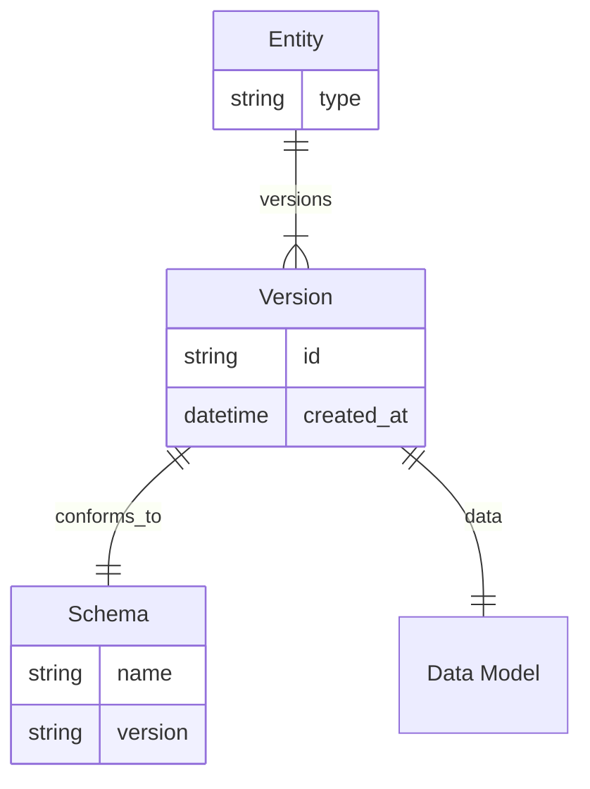
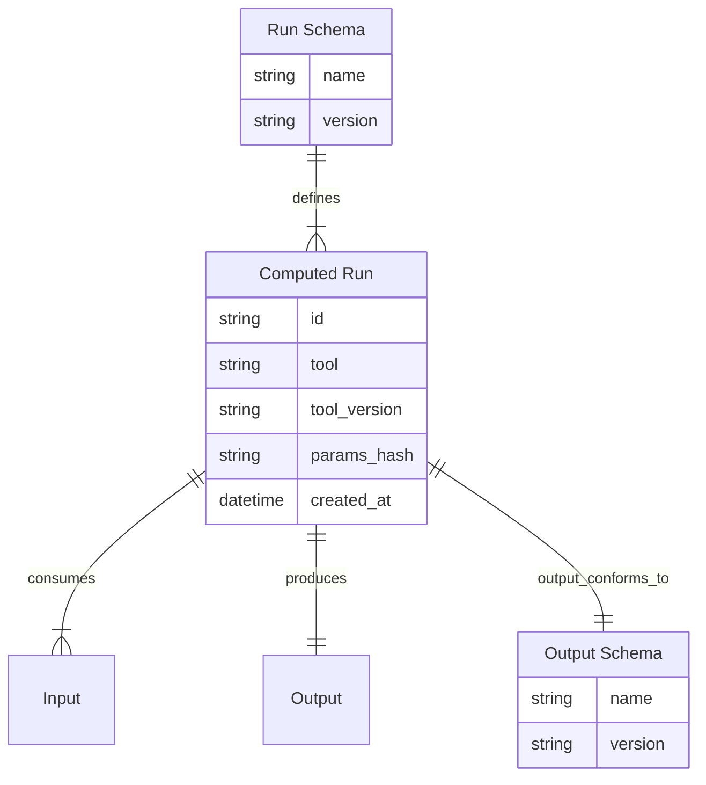

# Data Model Standards Reference

## Variant roots
When a root can have multiple variants, avoid polymorphic properties. Use a variant
root that is versioned and constrained by its own schema.

- **Entity**: Stable identity. Typed by `type`, invariant for the entity lifetime.
- **Version**: Unit of change. Owns its data and represents a snapshot or run.
- **Schema**: Versioned contract referenced by the version.
- **Data Model**: Schema-defined data owned by the version.

## Computed runs
Computed runs model data derived from other nodes and allow recomputation as
algorithms evolve. A computed run can attach to any node, conforms to a run
schema, and produces output conforming to an output schema.

- **Computed Run**: A single execution of a computation.
- **Run Schema**: Versioned contract for required inputs and parameters.
- **Inputs**: Nodes required to execute the run.
- **Output**: Data produced by the run.

