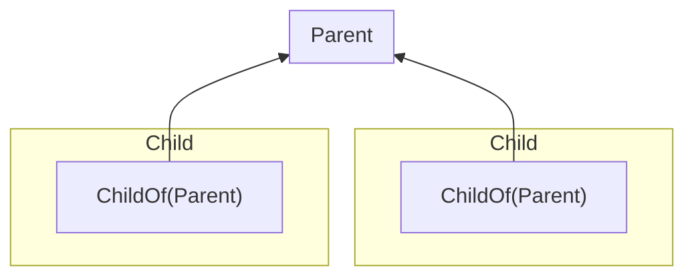
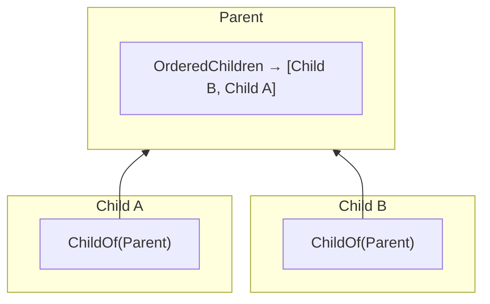

[](https://discord.gg/poimandres)


Koota is an ECS-based state management library optimized for real-time apps, games, and XR experiences. Use as much or as little as you need.

```bash
npm i koota
```

The official AI agent skill can be installed from this repo. [Read more about skills here](https://agentskills.io/home).

```bash
npx skills add pmndrs/koota
```

### First, define traits

Traits are the building blocks of your state. They represent slices of data with specific meanings.

```js
import { trait } from 'koota'

// Basic trait with default values
const Position = trait({ x: 0, y: 0 })
const Velocity = trait({ x: 0, y: 0 })

// Trait with a callback for initial value
// ⚠️ Must be an object
const Mesh = trait(() => new THREE.Mesh())

// Tag trait (no data)
const IsActive = trait()
```

### Spawn entities

Entities are spawned in a world. By adding traits to an entity they gain content.

```js
import { createWorld } from 'koota'

const world = createWorld()

const player = world.spawn(Position, Velocity)
// Initial values can be passed in to the trait by using it as a function
const goblin = world.spawn(Position({ x: 10, y: 10 }), Velocity, Mesh)
```

### Query and update data

Queries fetch entities sharing traits (archetypes). Use them to batch update entities efficiently. Writes made in `each` are change detected for traits tracked with `onChange` or `Changed`.

```js
// each passes each trait as its own argument, then the entity and index
// Writes land in the stores directly. Run this in a loop
world.query(Position, Velocity).each((position, velocity) => {
  position.x += velocity.x * delta
  position.y += velocity.y * delta
})

// Reads go through each as well
const data = []
world.query(Position, Velocity).each((position, velocity) => {
  data.push({ x: position.x, y: position.y })
})
```

### Use in your favorite reactive components

Traits can be used reactively inside of React or Svelte components.

<details open>
<summary>React</summary>

```js
import { WorldProvider, useQuery, useTrait } from 'koota/react'

// Wrap your app in WorldProvider
createRoot(document.getElementById('root')!).render(
    <WorldProvider world={world}>
        <App />
    </WorldProvider>
)

function RocketRenderer() {
    // Reactively update whenever the query updates with new entities
    const rockets = useQuery(Position, Velocity)
    return rockets.map((entity) => <RocketView key={entity} entity={entity} />)
}

function RocketView({ entity }) {
    // Observes this entity's position trait and reactively updates when it changes
    const position = useTrait(entity, Position)
    return (
        <div style={{ position: 'absolute', left: position.x ?? 0, top: position.y ?? 0 }}>
          🚀
        </div>
    )
}
```

See the [React API](docs/react/api.md) for all hooks and components.

</details>

<details>
<summary>Svelte</summary>

```svelte
<script>
  import { trait } from 'koota'
  import { provideWorld, useQuery, useTrait } from 'koota/svelte'

  const Position = trait({ x: 0, y: 0 })
  const Velocity = trait({ x: 0, y: 0 })

  let { entity } = $props()

  // Reactively update whenever the query updates with new entities
  const rockets = useQuery(() => [Position, Velocity])

  // Observes this entity's position trait and reactively updates when it changes
  const position = useTrait(() => entity, Position)
</script>

{#each rockets.current as entity (entity)}
  <RocketView {entity} />
{/each}
```

See the [Svelte API](docs/svelte/api.md) for all bindings.

</details>

### Mutate world with actions

Use actions to safely mutate the world from inside of React or Svelte in either effects or events.

<details open>
<summary>React</summary>

```js
import { createActions } from 'koota'
import { useActions } from 'koota/react'

const actions = createActions((world) => ({
  spawnShip: (position) => world.spawn(Position(position), Velocity),
  destroyAllShips: () => {
    world.query(Position, Velocity).forEach((entity) => {
      entity.destroy()
    })
  },
}))

function DoomButton() {
  const { spawnShip, destroyAllShips } = useActions(actions)

  // Spawn three ships on mount
  useEffect(() => {
    spawnShip({ x: 0, y: 1 })
    spawnShip({ x: 1, y: 0 })
    spawnShip({ x: 1, y: 1 })

    // Destroy all ships during cleanup
    return () => destroyAllShips()
  }, [])

  // And destroy all ships on click!
  return <button onClick={destroyAllShips}>Boom!</button>
}
```

Or access world directly and use it.

```js
const world = useWorld()

useEffect(() => {
  const entity = world.spawn(Velocity, Position)
  return () => entity.destroy()
})
```

</details>

<details>
<summary>Svelte</summary>

```svelte
<script>
  import { createActions } from 'koota'
  import { useActions } from 'koota/svelte'

  const actions = createActions((world) => ({
    spawnShip: (position) => world.spawn(Position(position), Velocity),
    destroyAllShips: () => {
      world.query(Position, Velocity).forEach((entity) => {
        entity.destroy()
      })
    },
  }))

  const { spawnShip, destroyAllShips } = useActions(actions)

  // Spawn three ships on mount
  $effect(() => {
    spawnShip({ x: 0, y: 1 })
    spawnShip({ x: 1, y: 0 })
    spawnShip({ x: 1, y: 1 })

    // Destroy all ships during cleanup
    return () => destroyAllShips()
  })
</script>

<!-- And destroy all ships on click! -->
<button onclick={destroyAllShips}>Boom!</button>
```

Or access world directly and use it.

```svelte
<script>
  import { useWorld } from 'koota/svelte'

  const world = useWorld()

  $effect(() => {
    const entity = world.spawn(Velocity, Position)
    return () => entity.destroy()
  })
</script>
```

</details>

## Advanced

### Finite state machines

A finite state machine groups ordinary traits into mutually exclusive states and declares the transitions between them. States are traits and can have data.

```ts
import { machine, trait } from 'koota'

const Pending = trait()
const Loading = trait({ progress: 0 })
const Loaded = trait()
const AssetMachine = machine({
  states: { Pending, Loading, Loaded },
  initial: Pending,
  transitions: {
    Pending: [Loading],
    Loading: [Pending, Loaded],
    Loaded: [Pending],
  },
})
```

Spawn with the machine to enter its initial state. Use `enter` to transition between states and `current` to read the current state.

```ts
const entity = world.spawn(AssetMachine) // Starts in Pending
AssetMachine.enter(entity, Loading({ progress: 0 })) // Transitions to Loading
AssetMachine.current(entity) === Loading // true
world.query(Loading) // All assets currently loading
AssetMachine.enter(entity, Loaded) // Transitions to Loaded

entity.add(Pending) // Transitions to Pending
entity.remove(AssetMachine) // Clears this entity's asset loading state
```

Observe each transition with `world.onTransition`.

```ts
world.onTransition(AssetMachine, (entity, from, to) => {
  console.log('Asset loading state changed', entity, from, to)
})
```

- Removing the current state trait throws. Remove the machine itself to leave it. Removing an absent state is a no-op.
- `enter`, `add` and `upsert` enforce the transition table. Illegal transitions throw with assertions enabled and otherwise do nothing. Adding the current state is a no-op, and upserting it only updates its data.
- To enable re-entry with a transition table, include the state in its own list, such as `Loading: [Loading, Loaded]`. Re-entering with `enter` replaces its data with supplied values and defaults.
- Declare the machine before any state is registered in a world, including through queries or subscriptions. Defining it alongside its states helps preserve that order.

### Relations

Koota supports relations between entities using the `relation` function. Relations allow you to build graphs by creating connections between entities with efficient queries.

```js
const ChildOf = relation()

const parent = world.spawn()
const child = world.spawn(ChildOf(parent))

const entity = world.queryFirst(ChildOf(parent)) // Returns child
```

A relation is typically owned by the entity that needs to express it. The **source** is the entity that has the relation added, and the **target** is the entity it points to.


```mermaid
flowchart BT
    subgraph Parent
    end
    subgraph childA["Child"]
        COA["ChildOf(Parent)"]
    end
    subgraph childB["Child"]
        COB["ChildOf(Parent)"]
    end
    COA --> Parent
    COB --> Parent
```

In `child.add(ChildOf(parent))`, child is the source and parent is the target. This design means the parent doesn't need to know about its children, instead children care about their parent, optimzing batch queries.

#### With data

Relations can contain data like any trait.

```js
const Contains = relation({ store: { amount: 0 } })

const inventory = world.spawn()
const gold = world.spawn()

// Pass initial data when adding
inventory.add(Contains(gold, { amount: 10 }))

// Update data with set
inventory.set(Contains(gold), { amount: 20 })

// Set the data if the pair exists, or add the pair with it
inventory.upsert(Contains(gold), { amount: 20 })

// Read data with get
const data = inventory.get(Contains(gold)) // { amount: 20 }
```

The values passed with a pair are typed by the store. A store field can be [required](#required-fields), and the pair must then carry it when it is added. Reads and queries still name the pair without values.

```ts
const Holds = relation({ store: { item: required<Item>(), count: 1 } })

holder.add(Holds(target, { item })) // count defaults to 1
holder.has(Holds(target)) // true

// ❌ Type error
holder.add(Holds(target))
```

A relation without a store has no record, so `get` returns `undefined` for its pairs. Check for a pair with `has`.

#### Auto destroy

Relations can automatically destroy related entities when their counterpart is destroyed using the `autoDestroy` option.

**Destroy orphans.** When a target is destroyed, destroy all sources pointing to it. This is commonly used for hierarchies when you want to clean up any detached graphs. It can be enabled with the `'orphan'` or `'source'` option.

```js
const ChildOf = relation({ autoDestroy: 'orphan' }) // Or 'source'

const parent = world.spawn()
const child = world.spawn(ChildOf(parent))
const grandchild = world.spawn(ChildOf(child))

parent.destroy()

world.has(child) // False, the child and grandchild are destroyed too
```

**Destroy targets.** When a source is destroyed, destroy all its targets.

```js
const Contains = relation({ autoDestroy: 'target' })

const container = world.spawn()
const itemA = world.spawn()
const itemB = world.spawn()

container.add(Contains(itemA), Contains(itemB))
container.destroy()

world.has(itemA) // False, items are destroyed with container
```

`Removed` queries can still read [relations on destroyed entities](docs/api/query-modifiers.md#destroyed-entities).

#### Exclusive relations

Exclusive relations ensure each entity can only have one target.

```js
const Targeting = relation({ exclusive: true })

const hero = world.spawn()
const rat = world.spawn()
const goblin = world.spawn()

hero.add(Targeting(rat))
hero.add(Targeting(goblin))

hero.has(Targeting(rat)) // False
hero.has(Targeting(goblin)) // True
```

#### Ordered relations

Ordered relations keep related entities in an explicit order. Add the ordered trait to the target entity.


```mermaid
flowchart BT
    subgraph Parent
        OC["OrderedChildren → [Child B, Child A]"]
    end
    subgraph childA["Child A"]
        COA["ChildOf(Parent)"]
    end
    subgraph childB["Child B"]
        COB["ChildOf(Parent)"]
    end
    COA --> Parent
    COB --> Parent
```

```js
import { ordered, relation, trait } from 'koota'

const Position = trait({ x: 0 })
const ChildOf = relation()
const OrderedChildren = ordered(ChildOf)

const parent = world.spawn(OrderedChildren)
const childA = world.spawn(Position)
const childB = world.spawn(Position)
const children = parent.get(OrderedChildren)

children.add(childA) // Adds ChildOf(parent)
childB.add(ChildOf(parent)) // Appends childB
children.moveTo(childB, 0) // Order: childB, childA
```

The view and relation stay in sync. Adding the same child twice has no effect. Edits notify the parent's ordered trait.

Iterate and update traits in child order. Each child must have the traits passed to `select`.

```js
children.at(0) // childB
const ids = children.map((child) => child.id())

children.select(Position).each((position, child, index) => {
  position.x = index * 100
})
```

Edit membership and order through the view:

```js
children.insert(childA, 0) // Moves an existing child to index 0
children.sort((a, b) => a.get(Position).x - b.get(Position).x)
children.reverse()
children.remove(childA) // Removes ChildOf(parent)
children.clear() // Removes all ChildOf(parent) pairs
```

Adding the ordered trait collects existing children. Removing it leaves their relations intact. Each walk keeps the sequence it started with.

Ordering work happens when children are added, removed, or reordered. For order derived from trait values, use a [sorted query](docs/api/query.md#ordered-views).

#### Querying relations

Relations can be queried with specific targets and wildcard targets using `*`.

```js
const gold = world.spawn()
const silver = world.spawn()
const inventory = world.spawn(Contains(gold), Contains(silver))

const targets = inventory.targetsFor(Contains) // Returns [gold, silver]

const chest = world.spawn(Contains(gold))

const containsSilver = world.query(Contains(silver)) // Returns [inventory]
const containsAnything = world.query(Contains('*')) // Returns [inventory, chest]
```

`each` passes targets discovered by `R('*')` and `R(query)` in query order before the source entity. Exclusive relations pass an `Entity`. Non-exclusive relations pass a read only array of the matching targets. Concrete `R(entity)` pairs only filter and contribute no callback argument.

```js
world.query(Targeting('*')).each((target, entity) => {
  entity.remove(Targeting(target))
})

world.query(Contains('*')).each((contents, inventory) => {
  for (const item of contents) {
    inventory.remove(Contains(item))
  }
})
```

Use `select` to skip reading targets. See [relation targets in each](docs/api/query.md#relation-targets-in-each) for more examples.

#### Relation filters

A query nested in a relation can be used to filter target entities instead of naming one specific target. Use them when you want to ask for relations pointing at "any player", "any active parent", or "any rare item".

```js
const IsRare = trait()

silver.add(IsRare)

const containsRareItems = world.query(Contains(IsRare))
const equippedOnAngryGoblin = world.query(EquippedOn(Goblin, IsAngry))
```

#### Removing relations

A relation targets a specific entity, so we need to likewise remove relations with specific entities.

```js
// Add a specific relation
player.add(Likes(apple))
player.add(Likes(banana))

// Remove that same relation
player.remove(Likes(apple))

player.has(apple) // false
player.has(banana) // true
```

However, a wildcard can be used to remove all relations of a kind — for all targets — from an entity.

```js
player.add(Likes(apple))
player.add(Likes(banana))

// Remove all Likes relations
player.remove(Likes('*'))

player.has(apple) // false
player.has(banana) // false
```

#### Tracking relation changes

Relations work with tracking modifiers to detect when entities gain, lose, or update relations. Use a relation store to track data writes.

```js
import { createAdded, createRemoved, createChanged } from 'koota'

const Added = createAdded()
const Removed = createRemoved()
const Changed = createChanged()

const ChildOf = relation({ store: { priority: 0 } })

// Track when any entity adds the ChildOf relation
const newChildren = world.query(Added(ChildOf))

// Track when any entity removes the ChildOf relation
const orphaned = world.query(Removed(ChildOf))

// Track relation additions and data writes
const updated = world.query(Changed(ChildOf))
```

Pass a pair to track one target. `Added(ChildOf(parent))` reports the entities that gained that pair and `Removed(ChildOf(parent))` those that lost it, including when the entity or the target is destroyed. `Changed(ChildOf(parent))` reports the entities whose pair was added or had its store data written.

```js
const parent = world.spawn()

// Track one pair
const newChildren = world.query(Added(ChildOf(parent)))
const lostChildren = world.query(Removed(ChildOf(parent)))
const updatedChildren = world.query(Changed(ChildOf(parent)))

// Track pairs by the target's traits
const newPlayerChildren = world.query(Added(ChildOf(IsPlayer)))
```

> 👉 **Note**<br>
> `Changed(ChildOf), ChildOf(parent)` is a different query. It tracks a change to any `ChildOf` pair of an entity and then filters by the entities that have `parent` as a target.

#### Relation events

Relations emit events per **pair**. This makes it easy to know exactly which target was involved.

- `onAdd(Relation, (entity, target) => {})` triggers when `entity.add(Relation(target))` is called.
- `onRemove(Relation, (entity, target) => {})` triggers when `entity.remove(Relation(target))` is called.
- `onChange(Relation, (entity, target) => {})` triggers when a pair is added or its store data is written. Pair additions also fire for relations without a store.

```js
const ChildOf = relation({ store: { priority: 0 } })

const unsubAdd = world.onAdd(ChildOf, (entity, target) => {})
const unsubRemove = world.onRemove(ChildOf, (entity, target) => {})
const unsubChange = world.onChange(ChildOf, (entity, target) => {})

const parent = world.spawn()
const child = world.spawn()

child.add(ChildOf(parent)) // onAdd(child, parent), onChange(child, parent)
child.set(ChildOf(parent), { priority: 1 }) // onChange(child, parent)
child.remove(ChildOf(parent)) // onRemove(child, parent)
```

Hooks also accept **relation pairs** for target-specific filtering. `ChildOf(parent)` only fires for that specific target, while `ChildOf('*')` fires for any target (equivalent to passing the relation itself).

```js
// Only fires when a ChildOf relation to this specific parent is added
world.onAdd(ChildOf(parent), (entity, target) => {})

// Fires for any ChildOf addition, the same as passing the ChildOf trait
world.onAdd(ChildOf('*'), (entity, target) => {})
```

### Identifiers

`identifier()` defines a namespace for scalar keys, such as names or network ids. Within each world, an entity has at most one key per namespace. Keys are exclusive by default, so each key has at most one owner. Keys are strings by default, or finite numbers with `identifier<number>()`.

```ts
import { identifier } from 'koota'

const Name = identifier()
const WireId = identifier<number>()

const player = world.spawn(Name('kris'), WireId(123), Position)
world.lookup(Name('kris')) // player, or undefined if absent
player.targetFor(Name) // 'kris'
player.has(WireId(123)) // true

player.add(WireId(456)) // Replaces the key
world.lookup(WireId(123)) // undefined
world.lookup(WireId(456)) // player

world.query(Name('kris'), Position) // Filter by key
world.query(Name, Position) // All entities with a Name and Position
```

Taken keys are refused and throw `[IDENTIFIER_TAKEN]` with assertions enabled. Look up first to find or create:

```ts
const player = world.lookup(Name('kris')) ?? world.spawn(Name('kris'), Position)
```

For values that multiple entities can share, such as user-entered names, set `exclusive: false`:

```ts
const DisplayName = identifier({ exclusive: false })
const first = world.spawn(DisplayName('kris'), Position)
const second = world.spawn(DisplayName('kris'), Position)

world.lookupAll(DisplayName('kris')) // [first, second]
world.query(DisplayName('kris'), Position) // Both entities
second.add(DisplayName('sam')) // Replaces only second's name
world.lookupAll(DisplayName('kris')) // [first]
```

`lookupAll` returns a snapshot array, or `[]` if there are no matches. `lookup` returns one current owner, or `undefined`. Both include excluded entities, while queries follow the normal exclusion rules. Each entity still has only one key per namespace.

Removing the identifier or destroying the entity frees its key. See [identifiers](docs/api/identifiers.md) for events, tracking and React hooks.

#### Scoped identifiers

Pass an exclusive relation as `scope` to make keys unique per parent instead of per world. A scoped lookup can be done using a path with one key per level, or starting from a known parent entity.

```ts
// The scoped relation must have exclusive set to true
const ChildOf = relation({ exclusive: true, autoDestroy: 'orphan' })
const Name = identifier({ scope: ChildOf })

const robot = world.spawn(Name('robot'))
const arm = world.spawn(Name('arm'), ChildOf(robot))
const motor = world.spawn(Name('motor'), ChildOf(arm))

world.lookup(Name('robot'), Name('arm'), Name('motor')) // motor
world.lookup(arm, Name('motor')) // motor
world.lookup(Name('motor')) // undefined, only the root scope is searched
world.query(Name('motor'), ChildOf(arm)) // Local names query across scopes, filter by parent
```

Scoping changes nothing about the relation. Reparenting moves names with the entity and refuses sibling collisions. Destroying a parent follows the relation's `autoDestroy`, so the subtree is destroyed here, while without it children move to the root scope. See [scoped identifiers](docs/api/identifiers.md#scoped-identifiers) for path queries and collision rules.

### Query modifiers

Modifiers are used to filter query results enabling powerful patterns. All modifiers can be mixed together.

#### Not

The `Not` modifier excludes entities that have specific traits from the query results.

```js
import { Not } from 'koota'

const staticEntities = world.query(Position, Not(Velocity))
```

`Not` also accepts relations and relation pairs. A bare relation excludes entities with any target, while a pair excludes only the entities that hold that pair.

```js
// Entities with no parent at all
const roots = world.query(Not(ChildOf))

// Everything that is not a child of the player, including entities with another parent
const others = world.query(Position, Not(ChildOf(player)))

// Pairs with a target query work too
const safe = world.query(Position, Not(ChildOf(IsHostile)))
```

#### Or

By default all query parameters are combined with logical AND. The `Or` modifier enables using logical OR instead.

```js
import { Or } from 'koota'

const movingOrVisible = world.query(Or(Velocity, Renderable))
```

Traits, relations and relation pairs can be mixed in one `Or`.

```js
// Children of either team, or any boss
const targets = world.query(Or(ChildOf(redTeam), ChildOf(blueTeam), IsBoss))
```

Tracking modifiers report changes since their query last ran. `Added` and `Changed` start with current matches. `Removed` starts with retained removals.

#### Added

The `Added` modifier tracks all entities that have added the specified traits or relations since the last time the query was run. A new instance of the modifier must be created for tracking to be unique.

When multiple traits are passed to `Added` it uses logical `AND`. Only entities where **all** specified traits have been added will be returned.

```js
import { createAdded } from 'koota'

const Added = createAdded()

// Track entities that added the Position trait
const newPositions = world.query(Added(Position))

// Track entities that added a ChildOf relation
const newChildren = world.query(Added(ChildOf))

// Track entities where BOTH Position AND Velocity were added
const fullyAdded = world.query(Added(Position, Velocity))

// Track entities where EITHER Position OR Velocity was added
const eitherAdded = world.query(Or(Added(Position), Added(Velocity)))

// After running the query, the Added modifier is reset
```

#### Removed

The `Removed` modifier tracks entities that removed the specified traits or relations since the last query, including destroyed entities. A new instance of the modifier must be created for tracking to be unique.

Removed data stays available through `.each()` or `.getPages()` so you can clean up resources. See the [query modifier API](docs/api/query-modifiers.md#destroyed-entities) for retention limits.

When multiple traits are passed to `Removed` it uses logical `AND`. Only entities where **all** specified traits have been removed will be returned.

```js
import { createRemoved } from 'koota'

const Removed = createRemoved()

// Track entities that removed the Velocity trait
const stoppedEntities = world.query(Removed(Velocity))

// Track entities that removed a ChildOf relation
const orphaned = world.query(Removed(ChildOf))

// Track entities where BOTH Position AND Velocity were removed
const fullyRemoved = world.query(Removed(Position, Velocity))

// Track entities where EITHER Position OR Velocity was removed
const eitherRemoved = world.query(Or(Removed(Position), Removed(Velocity)))

// After running the query, the Removed modifier is reset
```

#### Changed

`Changed` tracks additions and writes to the specified traits or relation stores. Its first run includes all current matches. Create a separate modifier for each independent reader.

When multiple traits are passed to `Changed` it uses logical `AND`. Only entities where **all** specified traits have changed will be returned.

```js
import { createChanged } from 'koota'

const Changed = createChanged()
const entity = world.spawn(Position)

// First run includes existing Position traits
world.query(Changed(Position))

entity.set(Position, { x: 10 })
// Later runs include additions and writes
const movedEntities = world.query(Changed(Position))

// Track ChildOf additions and data writes
const updatedChildren = world.query(Changed(ChildOf))

// Track entities where BOTH Position AND Velocity have changed
const fullyUpdated = world.query(Changed(Position, Velocity))

// Track entities where EITHER Position OR Velocity has changed
const eitherChanged = world.query(Or(Changed(Position), Changed(Velocity)))

// After running the query, the Changed modifier is reset
```

### Query lifecycle

Entities enter a query when they start matching and exit when they stop matching. Use `world.onEnter` and `world.onExit` with a query reference or an array of query parameters. Both return unsubscribe functions and report future events without replaying existing matches.

```js
const moving = createQuery(Position, Velocity)
const stopEnter = world.onEnter(moving, (entity) => startMoving(entity))
const stopExit = world.onExit(moving, (entity) => stopMoving(entity))

world.onEnter([Renderable, Not(Hidden)], (entity) => mount(entity))
world.onExit([Renderable, Not(Hidden)], (entity) => unmount(entity))

stopEnter()
stopExit()
```

Adding `Hidden` causes an exit, and removing it causes an entry. The same lifecycle applies to ordinary traits, relations and identifiers. See [query lifecycle](docs/api/query.md#query-lifecycle) for details.

### Add, remove and change events

Koota allows you to subscribe to add, remove, and change events for specific traits.

- `onAdd` triggers when `entity.add()` is called after the initial value has been set on the trait.
- `onRemove` triggers when `entity.remove()` is called, but before any data has been removed.
- `onChange` triggers after a trait is added (including spawn), written with `entity.set()` or `entity.upsert()`, or flagged with `entity.changed()`. It also reports writes detected by `.each()`.

Subscriptions only report future events. `Changed` queries also include current matches on their first run.

```js
// Subscribe to Position changes
const unsub = world.onChange(Position, (entity) => {
  console.log(`Entity ${entity} changed position`)
})

// Subscribe to Position additions
const unsub = world.onAdd(Position, (entity) => {
  console.log(`Entity ${entity} added position`)
})

// Subscribe to Position removals
const unsub = world.onRemove(Position, (entity) => {
  console.log(`Entity ${entity} removed position`)
})

// Trigger events
const entity = world.spawn(Position)
entity.set(Position, { x: 10, y: 20 })
entity.remove(Position)
```

When subscribing to relations, callbacks receive `(entity, target)` so you know which relation pair changed. Relation `onChange` events report pair additions and writes to relation store data.

```js
const Likes = relation()

const unsub = world.onAdd(Likes, (entity, target) => {
  console.log(`Entity ${entity} likes ${target}`)
})
```

### Per-entity events

The same hooks exist on entities and subscribe to only that entity's events.

```js
const entity = world.spawn(Position)

const unsub = entity.onChange(Position, (entity) => {
  console.log(`Position changed to ${entity.get(Position).x}`)
})

entity.onAdd(Position, (entity) => {})
entity.onRemove(Position, (entity) => {})
```

### World traits

For global data like time, these can be traits added to the world. **World traits do not appear in queries.**

```js
const Time = trait({ delta: 0, current: 0 })
world.add(Time)

const time = world.get(Time)
world.set(Time, { current: performance.now() })
```

### Select traits on queries for updates

`select` is used to choose what traits are fetched for `each` and `getPages`. This can be useful if your query is wider than the data you want to modify.

```js
// The query finds all entities with Position, Velocity and Mass
world
  .query(Position, Velocity, Mass)
  // And then select only Mass for updates
  .select(Mass)
  // Only mass will be used in the loop
  .each((mass) => {
    // We are going blackhole
    mass.value += 1
  })
```

### Ordered query views

Use `sort` to read query results in a chosen order.

```ts
const query = world.query(Position)
const sorted = query.sort(
  (a: Entity, b: Entity) => a.get(Position)!.x - b.get(Position)!.x,
  [Position]
)

sorted.each((position) => {
  console.log(position.x)
})
```

Pass the traits read by the comparator in the dependency array. The order refreshes on the next access after membership changes or writes to those traits. Omit the array or pass `[]` to sort on every access.

Active view walks keep their starting order. Re-enter the view after they finish to refresh it.

`sorted.entities` checks whether the order needs refreshing, then returns the cached array without an extra copy. Read it once before the loop:

```js
const entities = sorted.entities

for (let i = 0, length = entities.length; i < length; i++) {
  draw(entities[i])
}
```

Treat the array as read-only. Finish reading before accessing the view again or changing membership or sort data. Use the view's traversal methods for guarded walks, or `toArray()` for an independent copy.

### Modifying trait stores directly

For performance-critical operations, `getPages()` returns cached page views with direct access to trait arrays. Each page contains a `stores` tuple in query or `select()` order, `indices` for the matching store offsets, and an `entities` array aligned with those indices. The returned array supports both `for...of` and indexed loops.

```js
const pages = world.query(Position, Velocity).getPages()

for (const {
  stores: [position, velocity],
  indices,
} of pages) {
  for (let i = 0; i < indices.length; i++) {
    const offset = indices[i]
    position.x[offset] += velocity.x[offset] * delta
    position.y[offset] += velocity.y[offset] * delta
  }
}
```

`page.indices[i]` is the store offset for `page.entities[i]`. Use it to access values like `position.x[offset]` (SoA) or `objects[offset]` (AoS).

A tuple field's components start at the offset times the tuple's length. Write them in place.

```js
const Transform = trait({ position: [0, 0, 0] })
const Velocity = trait({ value: [0, 0, 0] })

for (const {
  stores: [transform, velocity],
  indices,
} of world.query(Transform, Velocity).getPages()) {
  for (let i = 0; i < indices.length; i++) {
    const offset = indices[i] * 3
    transform.position[offset] += velocity.value[offset] * delta
    transform.position[offset + 1] += velocity.value[offset + 1] * delta
    transform.position[offset + 2] += velocity.value[offset + 2] * delta
  }
}
```

Query each frame and finish the loop before adding or removing traits or entities. Direct writes don't notify subscribers. Call `entity.changed(Trait)` when you need notifications.

### Query tips for the curious

Performance and readability are often a tradeoff. The standard patterns are plenty fast, but if you are interested in diving deeper here are some quick tips.

#### Create update functions once

An inline callback is created each time `each` is called, then reused for the entities in that walk. Define it once if the same function can be shared across calls.

```js
// Create the function once
const handleMove = (position, velocity) => {}

function updateMovement(world) {
  // Use it for each
  world.query(Position, Velocity).each(handleMove)
}
```

#### Query results are live views

A query result is a cached live view over the query's entities. Use `map((entity, index) => value)` to build a new array in view order, or `toArray()` to copy the entities. Structural changes during view traversal with `for...of`, `forEach`, or `each` are safe.

```js
const entities = world.query(Position)

entities.length
entities.first
// Negative indices count from the end
entities.at(-1)

// Entities destroyed during a walk stay in the view until it ends and are
// skipped by each, entities spawned show up on the next run.
// Finish every for of loop you start, a suspended iterator keeps removals pending.
for (const entity of entities) {
  if (entity.has(IsDead)) entity.destroy()
}

// The view changes with the world, copy it to keep it
const kept = entities.toArray()
```

#### Iterating entities

Use `for...of` to iterate entities directly. For the fastest possible iteration, index `query.entities`, with the same performance as a native array.

```js
const query = world.query(Position)

for (const entity of query) {
  draw(entity)
}

const entities = query.entities
for (let i = 0, length = entities.length; i < length; i++) {
  draw(entities[i])
}
```

Treat the backing array as read-only and finish using it before another query run or membership change.

## APIs in detail until I make docs

These are more like notes for docs. Take a look around, ask questions. Eventually this will become proper docs.

### World

This is where all data is stored. We have methods on entities but this is a bit of a trick, entities don't actually store any data and instead it is operating on the connected world. Each world has its own set of entities that do not overlap with another. Typically you only need one world.

Worlds can have traits, which is our version of a singleton. Use these for global resources like a clock. Each world gets its own entity used for world traits. This entity is not queryable but will show up in the list of active entities making the only way to retrieve a world trait with its API.

The optional `retain` cap must be a non-negative safe integer.

```js
// Set the retention cap at creation (default 1024)
const world = createWorld({ retain: 1024 })
// Add singleton traits separately
world.add(Time, Config)

world.retain // 1024, read-only and preserved by reset

// Spawns an entity
// Can pass any number of traits
// Return Entity
const entity = world.spawn()

// Checks if the world has the entity
// Return boolean
const result = world.has(entity)

// Get all entities that match the query parameters
// Returns a QueryView, a live view over the matching entities
const entities = world.query(Position)

// Return the first entity that matches the query
// Return Entity
const entity = world.queryFirst(Position)

// Get the entity that owns an identifier key, see Identifiers
// Return Entity | undefined
const player = world.lookup(Name('player'))

// Get every entity that owns an identifier key
// Return Entity[]
const players = world.lookupAll(DisplayName('kris'))

// The trait API is identical to entity's

// Add a trait to the world
world.add(Time)

// Remove a trait from the world
world.remove(Time)

// Check if the world has a trait
// Return boolean
const result = world.has(Time)

// Returns the trait record for the world
// Return TraitRecord
const time = world.get(Time)

// Sets the trait and triggers a change event
world.set(Time, { current: performance.now() })
// Can take a callback with the previous state passed in
world.set(Time, (prev) => ({
  current: performance.now(),
  delta: performance.now() - prev.current,
}))

// Sets the value if the world has the trait, or adds the trait with the value if it does not
world.upsert(Time, { current: performance.now() })

// Subscribe to add, remove or change events for entity traits
// Return unsub function
const unsub = world.onAdd(Position, (entity) => {})
const unsub = world.onRemove(Position, (entity) => {})
const unsub = world.onChange(Position, (entity) => {})

// Hooks also accept relation pairs for target-specific filtering
const unsub = world.onAdd(ChildOf(parent), (entity, target) => {})
const unsub = world.onAdd(ChildOf('*'), (entity, target) => {})

// Subscribe to entities entering or exiting a query
// Entry starts matching, exit stops matching
// Return unsub function
const unsub = world.onEnter([Position, Velocity], (entity) => {})
const unsub = world.onExit([Position, Velocity], (entity) => {})

// Subscribe to entity lifecycle events
const unsub = world.onEntitySpawn((entity) => {})
const unsub = world.onEntityDestroy((entity) => {})

// Or trait registratoin if you are doing tooling
const unsub = world.onTraitRegistered((trait) => {})

// An array of all entities alive in the world, including non-queryable entities
// This is a copy so editing it won't do anything!
// Entity[]
world.entities

// Returns the world's unique ID (debug-only counter, not packed into entities)
// Return number
const id = world.id

// Resets the world as if it were just created
// The world reference is preserved
world.reset()

// Destroys the world, releasing all pages and entities
world.destroy()
```

### Entity

An entity is a number encoded with a world, generation and ID. Every entity is unique even if they have the same ID since they will have different generations. This makes automatic-recycling possible without reference errors. Because of this, the number of an entity won't give you its ID but will have to instead be decoded with `entity.id()`.

```js
// Add a trait to the entity
entity.add(Position)

// Remove a trait from the entity
entity.remove(Position)

// Checks if the entity has the trait
// Return boolean
const result = entity.has(Position)

// Gets the trait record for an entity
// Return TraitRecord
const position = entity.get(Position)
// Fills a record you own instead of allocating one, such as one from Position.record()
// Return the record, or undefined if the entity does not have the trait
entity.get(Position, position)

// Sets the trait and triggers a change event
// With assertions enabled, throws if the entity does not have the trait
entity.set(Position, { x: 10, y: 10 })
// Can take a callback with the previous state passed in
entity.set(Position, (prev) => ({
  x: prev + 1,
  y: prev + 1,
}))

// Sets the value if the entity has the trait, or adds the trait with the value if it does not
// Triggers a change event, and an add event when the trait is new
entity.upsert(Position, { x: 10 })

// Get the targets for a relation
// Return Entity[]
const targets = entity.targetsFor(Contains)

// Get the first target for a relation
// Return Entity
const target = entity.targetFor(Contains)

// Get the entity ID
// Return number
const id = entity.id()

// Get the entity generation
// Return number
const generation = entity.generation()

// Get the entity's key for an identifier
// Return string | number | undefined
const name = entity.targetFor(Name)

// Destroys the entity making its number no longer valid
entity.destroy()
```

For introspection, `unpackEntity` can be used to get all of the encoded values. This can be useful for debugging.

```js
const { entityId, generation } = unpackEntity(entity)
```

### Assertions

Development builds assert that the various API contracts hold such as entity lifetime, trait membership, relation consistency. They cost about 10% overhead on the various call paths, but are compiled out of production builds by default.

Define `__KOOTA_ASSERTS__` as `true` to retain them in production, or `false` to remove them completely from the application bundle.

### Warnings

Development builds warn about patterns that work but are slow, such as a tuple that mixes numbers with other values. Warnings are separate from assertions and compiled out of production builds by default.

Define `__KOOTA_WARNINGS__` as `true` to retain them in production, or `false` to remove them completely from the application bundle.

### Trait

Traits are self-contained slices of data you attach to an entity to define its state. They serve the same purpose as components in a traditional ECS. We call them traits to avoid confusion with React, Svelte, or web components.

A trait can be created with a schema that describes the kind of data it will hold.

```js
const Position = trait({ x: 0, y: 0, z: 0 })
```

A schema supports primitive values and [tuples](#tuples) with **no** nested objects or other arrays. In cases where the data needs to initialized for each instance of the trait, or complex structures are required, a callback initializer can be used.

```js
// ❌ Objects, and arrays that are not tuples, are not allowed in trait schemas
const Inventory = trait({
  items: [],
  vec3: { x: 0, y: 0, z: 0 },
  max: 10,
})

// ✅ Use a callback initializer for arrays and objects
const Inventory = trait({
  items: () => [],
  vec3: () => ({ x: 0, y: 0, z: 0 }),
  max: 10,
})
```

> ℹ️ **Why not support nested schemas?**<br>
> It looks obvious to support nested stores, but doing so makes algorithms that work with the data exponentially more complex. If all data can be assumed scalar then any operation is guaranteed to be the simplest and fastest algorithm possible. This is called the First Normal Form in relational database theory. [You can read more here](https://www.dataorienteddesign.com/dodbook/node3.html#SECTION00340000000000000000).

Sometimes a trait only has one field that points to an object instance. In cases like this, it is useful to skip the schema and use a callback directly in the trait.

```js
const Velocity = trait(() => new THREE.Vector3())

// The returned state is simply the instance
const velocity = entity.get(Velocity)
```

Both schema-based and callback-based traits are used similarly, but they have different performance implications due to how their data is stored internally:

1. Schema-based traits use a Structure of Arrays (SoA) storage.
2. Callback-based traits use an Array of Structures (AoS) storage.

[Learn more about AoS and SoA here](https://en.wikipedia.org/wiki/AoS_and_SoA).

#### Required fields

Some values have no sensible default, such as a DOM element or a Three object that only exists once the view mounts. Declare these with `required` and give the value when the trait is added. The type argument is the type of the value, and reads return it without `null`.

```ts
import { required, trait } from 'koota'

// A whole trait value
const Ref = trait(required<HTMLDivElement>())

// A single field next to fields with defaults
const View = trait({ object: required<THREE.Object3D>(), visible: true })

entity.add(Ref(div))
entity.add(View({ object: mesh }))

const view = entity.get(View) // { object: THREE.Object3D, visible: boolean }
```

Adding the trait without its required values is a type error. With [assertions](#assertions) enabled it also throws, and without them the value is left `undefined`.

```ts
// ❌ Both are type errors
entity.add(Ref)
entity.add(View({ visible: false }))
```

`Trait.record()` builds a record from the schema defaults and a required value has none. `View` returns a record with the required value `undefined` so that `get` out can fill it. However, `Ref` is nothing but its required value so no record can be built for it.

```ts
const view = View.record() // { object: undefined, visible: true }
entity.get(View, view) // { object: mesh, visible: true }

// ❌ A type error, and throws
Ref.record()
```

#### Tuples

A tuple is a fixed-size field such as a vector, quaternion, matrix or Euler. Its default sets its length, and the field is stored by value like any other primitive. This works directly with math libraries built on plain arrays, like [pmndrs/math](https://github.com/pmndrs/math).

```js
import { mat4, quat, vec3 } from 'math'

const Transform = trait({
  position: vec3.create(),
  rotation: quat.create(),
  scale: vec3.fromValues(1, 1, 1),
  matrix: mat4.create(),
})

entity.set(Transform, { position: [1, 2, 3] })

// Tuples are copied in and out, so this array never aliases the store
const { position } = entity.get(Transform)

// Mutating a tuple in each is detected per component
world.query(Transform, Velocity).each((transform, velocity) => {
  vec3.scaleAndAdd(transform.position, transform.position, velocity.value, delta)
})
```

A tuple holds at least one value and only primitives. Use a callback initializer for anything else, such as a list that grows.

#### Structure of Arrays (SoA) - Schema-based traits

When using a schema, each property is stored in its own array. This can lead to better cache locality when accessing a single property across many entities. This is always the fastest option for data that has intensive operations.

```js
const Position = trait({ x: 0, y: 0, z: 0 })

// Internally, this creates a store structure like:
const store = {
  x: [0, 0, 0, ...], // Array for x values
  y: [0, 0, 0, ...], // Array for y values
  z: [0, 0, 0, ...], // Array for z values
}
```

A tuple field is one array with each entity's components side by side.

```js
const Body = trait({ velocity: [0, 0, 0], mass: 1 })

// Internally, this creates a store structure like:
const store = {
  velocity: [x0, y0, z0, x1, y1, z1, ...], // Three values per entity
  mass: [1, 1, ...],
}
```

#### Array of Structures (AoS) - Callback-based traits

When using a callback, each entity's trait data is stored as an object in an array. This is best used for compatibility with third party libraries like Three, or class instances in general. The callback must return an object, or `null` for a reference that is empty until set. Primitive data belongs in a schema field.

```js
const Velocity = trait(() => ({ x: 0, y: 0, z: 0 }))

// Internally, this creates a store structure like:
const store = [
  { x: 0, y: 0, z: 0 },
  { x: 0, y: 0, z: 0 },
  { x: 0, y: 0, z: 0 },
  // ...
]

// Similarly, this will create a new instance of Mesh in each index
const Mesh = trait(() => new THREE.Mesh())
```

#### Trait record

The state of a given entity-trait pair is called a trait record and is like the row of a table in a database. When the trait store is SoA the record returned is a snapshot of the state while when it is AoS the record is a ref to the object inserted there. A tag has no data, so it has no record and `get` returns `undefined`. Check for it with `has`.

```js
// SoA store
const Position = trait({ x: 0, y: 0, z: 0 })
entity.add(Position)
// Returns a snapshot of the arrays
const position = entity.get(Position)
// position !== position2
const position2 = entity.get(Position)

// AoS store
const Velocity = trait(() => ({ x: 0, y: 0, z: 0 }))
entity.add(Velocity)
// Returns a ref to the object inserted
const velocity = entity.get(Velocity)
// velocity === velocity2
const velocity2 = entity.get(Velocity)
```

To read a SoA trait without allocating, pass a record you own. Koota fills it in place and returns it. `Trait.record()` creates one from the schema defaults with its own copy of every tuple, so make it once and reuse it. Relations have `record()` too, shaped by their store. AoS traits return their stored value, so they take no record.

```js
const transform = Transform.record() // allocates once

for (const entity of world.query(Transform)) {
  entity.get(Transform, transform) // refills it in place
  vec3.add(transform.position, transform.position, offset)
  entity.set(Transform, transform) // copies back without allocating
}
```

Note: A record from an earlier `get` works too!

Use `TraitRecord` to type this state.

```ts
const PositionRecord = TraitRecord<typeof Position>
```

#### Typing traits

Traits can have a schema type passed into its generic. This can be useful if the inferred type is not good enough.

```ts
type AttackerSchema = {
  continueCombo: boolean | null
  currentStageIndex: number | null
  stages: Array<AttackStage> | null
  startedAt: number | null
}

const Attacker = trait<AttackerSchema>({
  continueCombo: null,
  currentStageIndex: null,
  stages: null,
  startedAt: null,
})
```

However, this will not work with interfaces without a workaround due to intended behavior in TypeScript: https://github.com/microsoft/TypeScript/issues/15300
Interfaces can be used with `Pick` to convert the key signatures into something our type code can understand.

```ts
interface AttackerSchema {
  continueCombo: boolean | null
  currentStageIndex: number | null
  stages: Array<AttackStage> | null
  startedAt: number | null
}

// Pick is required to not get type errors
const Attacker = trait<Pick<AttackerSchema, keyof AttackerSchema>>({
  continueCombo: null,
  currentStageIndex: null,
  stages: null,
  startedAt: null,
})
```

#### Accessing the store directly

The store can be accessed with `getStore`, but this low-level access is risky as it bypasses Koota's guard rails. However, this can be useful for debugging where direct introspection of the store is needed. For direct store mutations, use the [`getPages` API](#modifying-trait-stores-directly) instead.

```js
// Returns SoA or AoS depending on the trait
const positions = getStore(world, Position)
```

### Query

A Koota query is a lot like a database query. Parameters define how to find entities and efficiently process them in batches. Queries are the primary way to update and transform your app state, similar to how you'd use SQL to filter and modify database records.

`each` is a zero-copy interface for reading and writing trait data. It passes each trait as its own argument followed by the entity and index. To keep a copy, call `entity.get(Trait)` for a snapshot.

#### Defining queries

Inline queries are great for readability and are optimized to be as fast as possible, but there is still some small overhead in hashing the query each time it is called.

```js
// Every time this query runs a hash for the query parameters (Position, Velocity)
// is created and then used to get the cached query internally
function updateMovement(world) {
  world.query(Position, Velocity).each((pos, vel) => {})
}
```

While this is not likely to be a bottleneck in your code compared to the actual update function, if you want to save these CPU cycles you can cache the query ahead of time and use the returned ref. This will have the additional effect of creating the internal query immediately on all worlds, otherwise it will get created the first time it is run.

```js
// The internal query is created immediately before it is invoked
const movementQuery = createQuery(Position, Velocity)

// The query ref is used for fast array-based lookup
function updateMovement(world) {
  world.query(movementQuery).each((pos, vel) => {})
}
```

#### Query all entities

To get all queryable entities you simply query the world with no parameters.

```js
const allEntities = world.query()
```

This differs from `world.entities` which includes all entities, even system ones. Koota excludes its internal system entities from queries to keep userland queries from being polluted.

#### Excluding entities from queries

Any entity can be excluded from queries by adding the built-in tag `IsExcluded` to it. System entities get this tag added to them so that they do not interfere with the app.

```js
const entity = world.spawn(Position)
// This entity can no longer be queried
entity.add(IsExcluded)

const entities = world.query(Position).toArray()
entities.includes(entity) // This will always be false
```

## React

See the [React API documentation](docs/react/api.md).

## Svelte

See the [Svelte API documentation](docs/svelte/api.md).
