[](https://discord.gg/poimandres)


Koota is an ECS-based state management library optimized for real-time apps, games, and XR experiences. Use as much or as little as you need.

```bash
npm i koota
```

👉 [Try the starter template](https://github.com/Ctrlmonster/r3f-koota-starter)

### First, define traits

Traits are the building blocks of your state. They represent slices of data with specific meanings.

```js
import { trait } from 'koota'

// Basic trait with default values
const Position = trait({ x: 0, y: 0 })
const Velocity = trait({ x: 0, y: 0 })

// Trait with a callback for initial value
// ⚠️ Must be an object
const Mesh = trait(() => new THREE.Mesh())

// Tag trait (no data)
const IsActive = trait()
```

### Spawn entities

Entities are spawned in a world. By adding traits to an entity they gain content.

```js
import { createWorld } from 'koota'

const world = createWorld()

const player = world.spawn(Position, Velocity)
// Initial values can be passed in to the trait by using it as a function
const goblin = world.spawn(Position({ x: 10, y: 10 }), Velocity, Mesh)
```

### Query and update data

Queries fetch entities sharing traits (archetypes). Use them to batch update entities efficiently.

```js
// updateEach mutates and writes back to stores
// Run this in a loop
world.query(Position, Velocity).updateEach(([position, velocity]) => {
  position.x += velocity.x * delta
  position.y += velocity.y * delta
})

// For read-only operations with no mutation, use readEach
const data = []
world.query(Position, Velocity).readEach(([position, velocity]) => {
  data.push({ x: position.x, y: position.y })
})
```

### Use in your React components

Traits can be used reactively inside of React components.

```js
import { WorldProvider, useQuery, useTrait } from 'koota/react'

// Wrap your app in WorldProvider
createRoot(document.getElementById('root')!).render(
    <WorldProvider world={world}>
        <App />
    </WorldProvider>
);

function RocketRenderer() {
    // Reactively update whenever the query updates with new entities
    const rockets = useQuery(Position, Velocity)
    return rockets.map((entity) => <RocketView key={entity} entity={entity} />)
}

function RocketView({ entity }) {
    // Observes this entity's position trait and reactively updates when it changes
    const position = useTrait(entity, Position)
    return (
        <div style={{ position: 'absolute', left: position.x ?? 0, top: position.y ?? 0 }}>
          🚀
        </div>
    )
}
```

### Modify Koota state safely with actions

Use actions to safely modify Koota from inside of React in either effects or events.

```js
import { createActions } from 'koota'
import { useActions } from 'koota/react'

const actions = createActions((world) => ({
  spawnShip: (position) => world.spawn(Position(position), Velocity),
  destroyAllShips: () => {
    world.query(Position, Velocity).forEach((entity) => {
      entity.destroy()
    })
  },
}))

function DoomButton() {
  const { spawnShip, destroyAllShips } = useActions(actions)

  // Spawn three ships on mount
  useEffect(() => {
    spawnShip({ x: 0, y: 1 })
    spawnShip({ x: 1, y: 0 })
    spawnShip({ x: 1, y: 1 })

    // Destroy all ships during cleanup
    return () => destroyAllShips()
  }, [])

  // And destroy all ships on click!
  return <button onClick={destroyAllShips}>Boom!</button>
}
```

Or access world directly and use it.

```js
const world = useWorld()

useEffect(() => {
  const entity = world.spawn(Velocity, Position)
  return () => entity.destroy()
})
```

## Advanced

### Relations

Koota supports relations between entities using the `relation` function. Relations allow you to build graphs by creating connections between entities with efficient queries.

```js
const ChildOf = relation()

const parent = world.spawn()
const child = world.spawn(ChildOf(parent))

const entity = world.queryFirst(ChildOf(parent)) // Returns child
```

A relation is typically owned by the entity that needs to express it. The **source** is the entity that has the relation added, and the **target** is the entity it points to.


In `child.add(ChildOf(parent))`, child is the source and parent is the target. This design means the parent doesn't need to know about its children, instead children care about their parent, optimzing batch queries.

#### With data

Relations can contain data like any trait.

```js
const Contains = relation({ store: { amount: 0 } })

const inventory = world.spawn()
const gold = world.spawn()

// Pass initial data when adding
inventory.add(Contains(gold, { amount: 10 }))

// Update data with set
inventory.set(Contains(gold), { amount: 20 })

// Read data with get
const data = inventory.get(Contains(gold)) // { amount: 20 }
```

#### Auto destroy

Relations can automatically destroy related entities when their counterpart is destroyed using the `autoDestroy` option.

**Destroy orphans.** When a target is destroyed, destroy all sources pointing to it. This is commonly used for hierarchies when you want to clean up any detached graphs. It can be enabled with the `'orphan'` or `'source'` option.

```js
const ChildOf = relation({ autoDestroy: 'orphan' }) // Or 'source'

const parent = world.spawn()
const child = world.spawn(ChildOf(parent))
const grandchild = world.spawn(ChildOf(child))

parent.destroy()

world.has(child) // False, the child and grandchild are destroyed too
```

**Destroy targets.** When a source is destroyed, destroy all its targets.

```js
const Contains = relation({ autoDestroy: 'target' })

const container = world.spawn()
const itemA = world.spawn()
const itemB = world.spawn()

container.add(Contains(itemA), Contains(itemB))
container.destroy()

world.has(itemA) // False, items are destroyed with container
```

#### Exclusive relations

Exclusive relations ensure each entity can only have one target.

```js
const Targeting = relation({ exclusive: true })

const hero = world.spawn()
const rat = world.spawn()
const goblin = world.spawn()

hero.add(Targeting(rat))
hero.add(Targeting(goblin))

hero.has(Targeting(rat)) // False
hero.has(Targeting(goblin)) // True
```

#### Ordered relations

> ⚠️ **Experimental**<br>
> This API is experimental and may change in future versions. Please provide feedback on GitHub or Discord.

Ordered relations maintain a list of related entities with
bidirectional sync.

A query like `world.query(ChildOf(parent))` returns a flat list of children without any ordering. If you need an ordered list, you'd have to store an order field and sort every time you query.

An ordered relation solves this by caching the order on the target. It's a trait added to the parent that maintains a view of all entities targeting it.

```mermaid
flowchart BT
    subgraph Parent
        OC["OrderedChildren → [Child B, Child A]"]
    end
    subgraph childA["Child A"]
        COA["ChildOf(Parent)"]
    end
    subgraph childB["Child B"]
        COB["ChildOf(Parent)"]
    end
    COA --> Parent
    COB --> Parent
```



```js
import { relation, ordered } from 'koota'

const ChildOf = relation()
const OrderedChildren = ordered(ChildOf)

const parent = world.spawn(OrderedChildren)
const children = parent.get(OrderedChildren)

children.push(child1) // adds ChildOf(parent) to child1
children.splice(0, 1) // removes ChildOf(parent) from child1

// Bidirectional sync works both ways
child2.add(ChildOf(parent)) // child2 automatically added to list
```

Ordered relations support array methods like `push()`, `pop()`, `shift()`, `unshift()`, and `splice()`, plus special methods `moveTo()` and `insert()` for precise control. Changes to the list automatically sync with relations, and vice versa.

> ⚠️ **Performance note**<br>
> Ordered relations requires additional bookkeeping where the cost of ordering is paid during structural changes (add, remove, move) instead of at query time. Use ordered relations only when entity order is essential or when hierarchical search (looping over children) is necessary.

#### Querying relations

Relations can be queried with specific targets and wildcard targets using `*`.

```js
const gold = world.spawn()
const silver = world.spawn()
const inventory = world.spawn(Contains(gold), Contains(silver))

const targets = inventory.targetsFor(Contains) // Returns [gold, silver]

const chest = world.spawn(Contains(gold))

const containsSilver = world.query(Contains(silver)) // Returns [inventory]
const containsAnything = world.query(Contains('*')) // Returns [inventory, chest]
```

#### Removing relations

A relation targets a specific entity, so we need to likewise remove relations with specific entities.

```js
// Add a specific relation
player.add(Likes(apple))
player.add(Likes(banana))

// Remove that same relation
player.remove(Likes(apple))

player.has(apple) // false
player.has(banana) // true
```

However, a wildcard can be used to remove all relations of a kind — for all targets — from an entity.

```js
player.add(Likes(apple))
player.add(Likes(banana))

// Remove all Likes relations
player.remove(Likes('*'))

player.has(apple) // false
player.has(banana) // false
```

#### Tracking relation changes

Relations work with tracking modifiers to detect when entities gain, lose, or update relations. Changes can only be tracked on relations that have a store.

> 👉 **Note**<br>
> You can currently only track changes to all relations of a given type, such as `ChildOf`, but not specific relation pairs, such as `ChildOf(parent)`.

```js
import { createAdded, createRemoved, createChanged } from 'koota'

const Added = createAdded()
const Removed = createRemoved()
const Changed = createChanged()

const ChildOf = relation({ store: { priority: 0 } })

// Track when any entity adds the ChildOf relation
const newChildren = world.query(Added(ChildOf))

// Track when any entity removes the ChildOf relation
const orphaned = world.query(Removed(ChildOf))

// Track when relation data changes for any target
const updated = world.query(Changed(ChildOf))
```

Combine with relation filters to track changes for specific targets.

```js
const parent = world.spawn()

// Track changes only for entities related to parent
const changedChildren = world.query(Changed(ChildOf), ChildOf(parent))
```

#### Relation events

Relations emit events per **relation pair**. This makes it easy to know exactly which target was involved.

- `onAdd(Relation, (entity, target) => {})` triggers when `entity.add(Relation(target))` is called.
- `onRemove(Relation, (entity, target) => {})` triggers when `entity.remove(Relation(target))` is called.
- `onChange(Relation, (entity, target) => {})` triggers when relation **store data** is updated with `entity.set(Relation(target), data)` (only for relations created with a `store`).

```js
const ChildOf = relation({ store: { priority: 0 } })

const unsubAdd = world.onAdd(ChildOf, (entity, target) => {})
const unsubRemove = world.onRemove(ChildOf, (entity, target) => {})
const unsubChange = world.onChange(ChildOf, (entity, target) => {})

const parent = world.spawn()
const child = world.spawn()

child.add(ChildOf(parent)) // onAdd(child, parent)
child.set(ChildOf(parent), { priority: 1 }) // onChange(child, parent)
child.remove(ChildOf(parent)) // onRemove(child, parent)
```

### Query modifiers

Modifiers are used to filter query results enabling powerful patterns. All modifiers can be mixed together.

#### Not

The `Not` modifier excludes entities that have specific traits from the query results.

```js
import { Not } from 'koota'

const staticEntities = world.query(Position, Not(Velocity))
```

#### Or

By default all query parameters are combined with logical AND. The `Or` modifier enables using logical OR instead.

```js
import { Or } from 'koota'

const movingOrVisible = world.query(Or(Velocity, Renderable))
```

#### Added

The `Added` modifier tracks all entities that have added the specified traits or relations since the last time the query was run. A new instance of the modifier must be created for tracking to be unique.

```js
import { createAdded } from 'koota'

const Added = createAdded()

// Track entities that added the Position trait
const newPositions = world.query(Added(Position))

// Track entities that added a ChildOf relation
const newChildren = world.query(Added(ChildOf))

// After running the query, the Added modifier is reset
```

#### Removed

The `Removed` modifier tracks all entities that have removed the specified traits or relations since the last time the query was run. This includes entities that have been destroyed. A new instance of the modifier must be created for tracking to be unique.

```js
import { createRemoved } from 'koota'

const Removed = createRemoved()

// Track entities that removed the Velocity trait
const stoppedEntities = world.query(Removed(Velocity))

// Track entities that removed a ChildOf relation
const orphaned = world.query(Removed(ChildOf))

// After running the query, the Removed modifier is reset
```

#### Changed

The `Changed` modifier tracks all entities that have had the specified traits or relation stores change since the last time the query was run. A new instance of the modifier must be created for tracking to be unique.

When multiple traits are passed to `Changed` it uses logical `AND`. Only entities where **all** specified traits have changed will be returned.

```js
import { createChanged } from 'koota'

const Changed = createChanged()

// Track entities whose Position has changed
const movedEntities = world.query(Changed(Position))

// Track entities whose ChildOf relation data has changed
const updatedChildren = world.query(Changed(ChildOf))

// Track entities where BOTH Position AND Velocity have changed
const fullyUpdated = world.query(Changed(Position, Velocity))

// After running the query, the Changed modifier is reset
```

### Add, remove and change events

Koota allows you to subscribe to add, remove, and change events for specific traits.

- `onAdd` triggers when `entity.add()` is called after the initial value has been set on the trait.
- `onRemove` triggers when `entity.remove()` is called, but before any data has been removed.
- `onChange` triggers when an entity's trait value has been set with `entity.set()` or when it is manually flagged with `entity.changed()`.

```js
// Subscribe to Position changes
const unsub = world.onChange(Position, (entity) => {
  console.log(`Entity ${entity} changed position`)
})

// Subscribe to Position additions
const unsub = world.onAdd(Position, (entity) => {
  console.log(`Entity ${entity} added position`)
})

// Subscribe to Position removals
const unsub = world.onRemove(Position, (entity) => {
  console.log(`Entity ${entity} removed position`)
})

// Trigger events
const entity = world.spawn(Position)
entity.set(Position, { x: 10, y: 20 })
entity.remove(Position)
```

When subscribing to relations, callbacks receive `(entity, target)` so you know which relation pair changed. Relation `onChange` events are triggered by `entity.set(Relation(target), data)` and only on relations with data via the store prop.

```js
const Likes = relation()

const unsub = world.onAdd(Likes, (entity, target) => {
  console.log(`Entity ${entity} likes ${target}`)
})
```

### Change detection with `updateEach`

By default, `updateEach` will automatically turn on change detection for traits that are being tracked via `onChange` or the `Changed` modifier. If you want to silence change detection for a loop or force it to always run, you can do so with an options config.

```js
// Setting changeDetection to 'never' will silence it, triggering no change events
world.query(Position, Velocity).updateEach(([position, velocity]) => {}, { changeDetection: 'never' })

// Setting changeDetection to 'always' will ignore selective tracking and always emit change events for all traits that are mutated
world
  .query(Position, Velocity)
  .updateEach(([position, velocity]) => {}, { changeDetection: 'always' })
```

Changed detection shallowly compares the scalar values just like React. This means objects and arrays will only be detected as changed if a new object or array is committed to the store. While immutable state is a great design pattern, it creates memory pressure and reduces performance so instead you can mutate and manually flag that a changed has occured.

```js
// ❌ This change will not be detected since the array is mutated and will pass the comparison
world.query(Inventory).updateEach(([inventory]) => {
  inventory.items.push(item)
})

// ✅ This change will be detected since a new array is created and the comparison will fail
world.query(Inventory).updateEach(([inventory]) => {
  inventory.items = [...inventory.items, item]
})

// ✅ This change is manually flagged and we still get to mutate for performance
world.query(Inventory).updateEach(([inventory], entity) => {
  inventory.items.push(item)
  entity.changed()
})
```

### World traits

For global data like time, these can be traits added to the world. **World traits do not appear in queries.**

```js
const Time = trait({ delta: 0, current: 0 })
world.add(Time)

const time = world.get(Time)
world.set(Time, { current: performance.now() })
```

### Select traits on queries for updates

Query filters entity results and `select` is used to choose what traits are fetched for `updateEach` and `useStores`. This can be useful if your query is wider than the data you want to modify.

```js
// The query finds all entities with Position, Velocity and Mass
world.query(Position, Velocity, Mass)
  // And then select only Mass for updates
  .select(Mass)
  // Only mass will be used in the loop
  .updateEach([mass] => {
    // We are going blackhole
    mass.value += 1
  });
```

### Modifying trait stores directly

For performance-critical operations, you can modify trait stores directly using the `useStores` hook. This approach bypasses some of the safety checks and event triggers, so use it with caution. All stores are structure of arrays for performance purposes.

```js
// Returns the SoA stores
world.query(Position, Velocity).useStores(([position, velocity], entities) => {
  // Write our own loop over the stores
  for (let i = 0; i < entities.length; i++) {
    // Get the entity ID to use as the array index
    const eid = entities[i].id()
    // Write to each array in the store
    position.x[eid] += velocity.x[eid] * delta
    position.y[eid] += velocity.y[eid] * delta
  }
})
```

### Query tips for the curious

Performance and readability are often a tradeoff. The standard patterns are plenty fast, but if you are interested in diving deeper here are some quick tips.

#### Create update functions once

The standard pattern for `updateEach`, and handlers in general, uses an arrow function. This has great readability since the function logic is colocated with with query, but it comes at the cost of creating a new function for every entity being updated. This can be mitigated by creating the update function once in module scope.

```js
// Create the function once
const handleMove = ([position, velocity]) => {}

function updateMovement(world) {
  // Use it for the updateEach
  world.query(Position, Velocity).updateEach(handleMove)
}
```

#### You can use `for of` instead of `forEach` on query results

A query result is just an array of entities with some extra methods. This means you can use `for of` instead of `forEach` to get a nice iterator. Additionally, this will save a little performance since `forEach` calls a function on each member, while `for of` will compile down to what is basically a for loop.

```js
// This is nice and ergonomic but will cost some overhead since we are
// creating a fresh function for each entity and then calling it
world.query().forEach((entity) => {})

// By contrast, this compiles down to a for loop and will have a
// single block of code executed for each entity
for (const entity of world.query()) {
}
```

## APIs in detail until I make docs

These are more like notes for docs. Take a look around, ask questions. Eventually this will become proper docs.

### World

This is where all data is stored. We have methods on entities but this is a bit of a trick, entities don't actually store any data and instead it is operating on the connected world. Each world has its own set of entities that do not overlap with another. Typically you only need one world.

Worlds can have traits, which is our version of a singleton. Use these for global resources like a clock. Each world gets its own entity used for world traits. This entity is not queryable but will show up in the list of active entities making the only way to retrieve a world trait with its API.

```js
// Spawns an entity
// Can pass any number of traits
// Return Entity
const entity = world.spawn()

// Checks if the world has the entity
// Return boolean
const result = world.has(entity)

// Get all entities that match the query parameters
// Return QueryResult (which is Entity[] with extras)
const entities = world.query(Position)

// Return the first entity that matches the query
// Return Entity
const entity = world.queryFirst(Position)

// The trait API is identical to entity's

// Add a trait to the world
world.add(Time)

// Remove a trait from the world
world.remove(Time)

// Check if the world has a trait
// Return boolean
const result = world.has(Time)

// Returns the trait record for the world
// Return TraitRecord
const time = world.get(Time)

// Sets the trait and triggers a change event
world.set(Time, { current: performance.now() })
// Can take a callback with the previous state passed in
world.set(Time, (prev) => ({
  current: performance.now(),
  delta: performance.now() - prev.current,
}))

// Subscribe to add, remove or change events for entity traits
// Return unsub function
const unsub = world.onAdd(Position, (entity) => {})
const unsub = world.onRemove(Position, (entity) => {})
const unsub = world.onChange(Position, (entity) => {})

// Subscribe to add or remove query events
// This triggers whenever a query is updated
// Return unsub function
const unsub = world.onQueryAdd([Position, Velocity], (entity) => {})
const unsub = world.onQueryRemove([Position, Velocity], (entity) => {})

// An array of all entities alive in the world, including non-queryable entities
// This is a copy so editing it won't do anything!
// Entity[]
world.entities

// Returns the world's unique ID
// Return number
const id = world.id()

// Resets the world as if it were just created
// The world ID and reference is preserved
world.reset()

// Nukes the world and releases its ID
world.destroy()
```

### Entity

An entity is a number encoded with a world, generation and ID. Every entity is unique even if they have the same ID since they will have different generations. This makes automatic-recycling possible without reference errors. Because of this, the number of an entity won't give you its ID but will have to instead be decoded with `entity.id()`.

```js
// Add a trait to the entity
entity.add(Position)

// Remove a trait from the entity
entity.remove(Position)

// Checks if the entity has the trait
// Return boolean
const result = entity.has(Position)

// Gets the trait record for an entity
// Return TraitRecord
const position = entity.get(Position)

// Sets the trait and triggers a change event
entity.set(Position, { x: 10, y: 10 })
// Can take a callback with the previous state passed in
entity.set(Position, (prev) => ({
  x: prev + 1,
  y: prev + 1,
}))

// Get the targets for a relation
// Return Entity[]
const targets = entity.targetsFor(Contains)

// Get the first target for a relation
// Return Entity
const target = entity.targetFor(Contains)

// Get the entity ID
// Return number
const id = entity.id()

// Get the entity generation
// Return number
const generation = entity.generation()

// Destroys the entity making its number no longer valid
entity.destroy()
```

For introspection, `unpackEntity` can be used to get all of the encoded values. This can be useful for debugging.

```js
const { entityId, generation, worldId } = unpackEntity(entity)
```

### Trait

Traits are self-contained slices of data you attach to an entity to define its state. They serve the same purpose as components in a traditional ECS. We call them traits to avoid confusion with React or web components.

A trait can be created with a schema that describes the kind of data it will hold.

```js
const Position = trait({ x: 0, y: 0, z: 0 })
```

A schema supports primitive values with **no** nested objects or arrays. In cases where the data needs to initialized for each instance of the trait, or complex structures are required, a callback initializer can be used.

```js
// ❌ Arrays and objects are not allowed in trait schemas
const Inventory = trait({
  items: [],
  vec3: { x: 0, y: 0, z: 0}
  max: 10,
})

// ✅ Use a callback initializer for arrays and objects
const Inventory = trait({
  items: () => [],
  vec3: () => ({ x: 0, y: 0, z: 0})
  max: 10,
})
```

> ℹ️ **Why not support nested schemas?**<br>
> It looks obvious to support nested stores, but doing so makes algorithms that work with the data exponentially more complex. If all data can be assumed scalar then any operation is guaranteed to be the simplest and fastest algorithm possible. This is called the First Normal Form in relational database theory. [You can read more here](https://www.dataorienteddesign.com/dodbook/node3.html#SECTION00340000000000000000).

Sometimes a trait only has one field that points to an object instance. In cases like this, it is useful to skip the schema and use a callback directly in the trait.

```js
const Velocity = trait(() => new THREE.Vector3())

// The returned state is simply the instance
const velocity = entity.get(Velocity)
```

Both schema-based and callback-based traits are used similarly, but they have different performance implications due to how their data is stored internally:

1. Schema-based traits use a Structure of Arrays (SoA) storage.
2. Callback-based traits use an Array of Structures (AoS) storage.

[Learn more about AoS and SoA here](https://en.wikipedia.org/wiki/AoS_and_SoA).

#### Structure of Arrays (SoA) - Schema-based traits

When using a schema, each property is stored in its own array. This can lead to better cache locality when accessing a single property across many entities. This is always the fastest option for data that has intensive operations.

```js
const Position = trait({ x: 0, y: 0, z: 0 });

// Internally, this creates a store structure like:
const store = {
  x: [0, 0, 0, ...], // Array for x values
  y: [0, 0, 0, ...], // Array for y values
  z: [0, 0, 0, ...], // Array for z values
};
```

#### Array of Structures (AoS) - Callback-based traits

When using a callback, each entity's trait data is stored as an object in an array. This is best used for compatibility with third party libraries like Three, or class instances in general.

```js
const Velocity = trait(() => ({ x: 0, y: 0, z: 0 }))

// Internally, this creates a store structure like:
const store = [
  { x: 0, y: 0, z: 0 },
  { x: 0, y: 0, z: 0 },
  { x: 0, y: 0, z: 0 },
  // ...
]

// Similarly, this will create a new instance of Mesh in each index
const Mesh = trait(() => new THREE.Mesh())
```

#### Trait record

The state of a given entity-trait pair is called a trait record and is like the row of a table in a database. When the trait store is SoA the record returned is a snapshot of the state while when it is AoS the record is a ref to the object inserted there.

```js
// SoA store
const Position = trait({ x: 0, y: 0, z: 0 })
entity.add(Position)
// Returns a snapshot of the arrays
const position = entity.get(Position)
// position !== position2
const position2 = entity.get(Position)

// AoS store
const Velocity = trait(() => ({ x: 0, y: 0, z: 0 }))
entity.add(Velocity)
// Returns a ref to the object inserted
const velocity = entity.get(Velocity)
// velocity === velocity2
const velocity2 = entity.get(Velocity)
```

Use `TraitRecord` to type this state.

```ts
const PositionRecord = TraitRecord<typeof Position>
```

#### Typing traits

Traits can have a schema type passed into its generic. This can be useful if the inferred type is not good enough.

```ts
type AttackerSchema = {
  continueCombo: boolean | null
  currentStageIndex: number | null
  stages: Array<AttackStage> | null
  startedAt: number | null
}

const Attacker = trait<AttackerSchema>({
  continueCombo: null,
  currentStageIndex: null,
  stages: null,
  startedAt: null,
})
```

However, this will not work with interfaces without a workaround due to intended behavior in TypeScript: https://github.com/microsoft/TypeScript/issues/15300
Interfaces can be used with `Pick` to convert the key signatures into something our type code can understand.

```ts
interface AttackerSchema {
  continueCombo: boolean | null
  currentStageIndex: number | null
  stages: Array<AttackStage> | null
  startedAt: number | null
}

// Pick is required to not get type errors
const Attacker = trait<Pick<AttackerSchema, keyof AttackerSchema>>({
  continueCombo: null,
  currentStageIndex: null,
  stages: null,
  startedAt: null,
})
```

#### Accessing the store directly

The store can be accessed with `getStore`, but this low-level access is risky as it bypasses Koota's guard rails. However, this can be useful for debugging where direct introspection of the store is needed. For direct store mutations, use the [`useStores` API](#modifying-trait-stores-direclty) instead.

```js
// Returns SoA or AoS depending on the trait
const positions = getStore(world, Position)
```

### Query

A Koota query is a lot like a database query. Parameters define how to find entities and efficiently process them in batches. Queries are the primary way to update and transform your app state, similar to how you'd use SQL to filter and modify database records.

#### Defining queries

Inline queries are great for readability and are optimized to be as fast as possible, but there is still some small overhead in hashing the query each time it is called.

```js
// Every time this query runs a hash for the query parameters (Position, Velocity)
// is created and then used to get the cached query internally
function updateMovement(world) {
  world.query(Position, Velocity).updateEach(([pos, vel]) => {})
}
```

While this is not likely to be a bottleneck in your code compared to the actual update function, if you want to save these CPU cycles you can cache the query ahead of time and use the returned ref. This will have the additional effect of creating the internal query immediately on all worlds, otherwise it will get created the first time it is run.

```js
// The internal query is created immediately before it is invoked
const movementQuery = defineQuery(Position, Velocity)

// The query ref is used for fast array-based lookup
function updateMovement(world) {
  world.query(movementQuery).updateEach(([pos, vel]) => {})
}
```

#### Query all entities

To get all queryable entities you simply query the world with no parameters.

```js
const allEntities = world.query()
```

This differs from `world.entities` which includes all entities, even system ones. Koota excludes its internal system entities from queries to keep userland queries from being polluted.

#### Excluding entities from queries

Any entity can be excluded from queries by adding the built-in tag `IsExcluded` to it. System entities get this tag added to them so that they do not interfere with the app.

```js
const entity = world.spawn(Position)
// This entity can no longer be queried
entity.add(IsExcluded)

const entities = world.query(Position)
entities.includes(entity) // This will always be false
```

### React

### `useQuery`

Reactively updates when entities matching the query changes. Returns a `QueryResult`, which is like an array of entities.

```js
// Get all entities with Position and Velocity traits
const entities = useQuery(Position, Velocity)

// Render a view
return (
  <>
    {entities.map((entity) => (
      <View key={entity.id()} entity={entity} />
    ))}
  </>
)
```

### `useQueryFirst`

Works like `useQuery` but only returns the first result. Can either be an entity of undefined.

```js
// Get the first entity with Player and Position traits
const player = useQueryFirst(Player, Position)

// Render a view if an entity is found
return player ? <View entity={player} /> : null
```

### `useWorld`

Returns the world held in context via `WorldProvider`.

```js
// Get the default world
const world = useWorld();

// Use the world to create an entity on mount
useEffect(() => {
    const entity = world.spawn()
    return => entity.destroy()
}, [])

```

### `WorldProvider`

The provider for the world context. A world must be created and passed in.

```js
// Create a world and pass it to the provider
const world = createWorld()

// All hooks will now use this world instead of the default
function App() {
  return (
    <WorldProvider world={world}>
      <Game />
    </WorldProvider>
  )
}
```

### `useTrait`

Observes an entity, or world, for a given trait and reactively updates when it is added, removed or changes value. The returned trait snapshot maybe `undefined` if the trait is no longer on the target. This can be used to conditionally render.

```js
// Get the position trait from an entity and reactively updates when it changes
const position = useTrait(entity, Position)

// If position is removed from entity then it will be undefined
if (!position) return null

// Render the position
return (
  <div>
    Position: {position.x}, {position.y}
  </div>
)
```

The entity passed into `useTrait` can be `undefined` or `null`. This helps with situations where `useTrait` is combined with queries in the same component since hooks cannot be conditionally called. However, this means that result can be `undefined` if the trait is not on the entity or if the target is itself `undefined`. In most cases the distinction will not matter, but if it does you can disambiguate by testing the target.

```js
// The entity may be undefined if there is no valid result
const entity = useQueryFirst(Position, Velocity)
// useTrait handles this by returned undefined if the target passed in does not exist
const position = useTrait(entity, Position)

// However, undefined here can mean no entity or no component on entity
// To make the outcome no longer ambiguous you have to test the entity
if (!entity) return <div>No entity found!</div>

// Now this is narrowed to Position no longer being on the component
if (!position) return null

return (
  <div>
    Position: {position.x}, {position.y}
  </div>
)
```

### `useTag`

Observes an entity, or world, for a tag and reactively updates when it is added or removed. Returns `true` when the tag is present or `false` when absent. Use this instead of `useTrait` for tags. For tracking the presence of non-tag traits, use `useHas`.

```js
const IsActive = trait()

function ActiveIndicator({ entity }) {
  // Returns true if the entity has the tag, false otherwise
  const isActive = useTag(entity, IsActive)

  if (!isActive) return null

  return <div>🟢 Active</div>
}
```

### `useHas`

Observes an entity, or world, for any trait and reactively updates when it is added or removed. Returns `true` when the trait is present or `false` when absent. Unlike `useTrait`, this only tracks presence and not the trait's value.

```js
const Health = trait({ amount: 100 })

function HealthIndicator({ entity }) {
  // Returns true if the entity has the trait, false otherwise
  const hasHealth = useHas(entity, Health)

  if (!hasHealth) return null

  return <div>❤️ Has Health</div>
}
```

### `useTraitEffect`

Subscribes a callback to a trait on an entity. This callback fires as an effect whenever it is added, removed or changes value without rerendering.

```js
// Subscribe to position changes on an entity and update a ref without causing a rerender
useTraitEffect(entity, Position, (position) => {
  if (!position) return
  meshRef.current.position.copy(position)
})

// Subscribe to world-level traits
useTraitEffect(world, GameState, (state) => {
  if (!state) return
  console.log('Game state changed:', state)
})
```

### `useTarget`

Observes an entity, or world, for a relation and reactively returns the first target entity. Returns `undefined` if no target exists.

```js
const ChildOf = relation()

function ParentDisplay({ entity }) {
  // Returns the first target of the ChildOf relation
  const parent = useTarget(entity, ChildOf)

  if (!parent) return <div>No parent</div>

  return <div>Parent: {parent.id()}</div>
}
```

### `useTargets`

Observes an entity, or world, for a relation and reactively returns all target entities as an array. Returns an empty array if no targets exist.

```js
const Contains = relation()

function InventoryDisplay({ entity }) {
  // Returns all targets of the Contains relation
  const items = useTargets(entity, Contains)

  return (
    <ul>
      {items.map((item) => (
        <li key={item.id()}>Item {item.id()}</li>
      ))}
    </ul>
  )
}
```

### `useActions`

Returns actions bound to the world that is in context. Use actions created by `createActions`.

```js
// Create actions
const actions = createActions((world) => ({
    spawnPlayer: () => world.spawn(IsPlayer).
    destroyAllPlayers: () => {
        world.query(IsPlayer).forEach((player) => {
            player.destroy()
        })
    }
}))

// Get actions bound to the world in context
const { spawnPlayer, destroyAllPlayers } = useActions();

// Call actions to modify the world in an effect or handlers
useEffect(() => {
    spawnPlayer()
    return () => destroyAllPlayers()
}, [])
```
