Koota supports relations between entities using the `relation` function. Relations allow you to build graphs by creating connections between entities with efficient queries.

```js
const ChildOf = relation()

const parent = world.spawn()
const child = world.spawn(ChildOf(parent))

const entity = world.queryFirst(ChildOf(parent)) // Returns child
```

A relation is typically owned by the entity that needs to express it. The **source** is the entity that has the relation added, and the **target** is the entity it points to.


In `child.add(ChildOf(parent))`, child is the source and parent is the target. This design means the parent doesn't need to know about its children, instead children care about their parent, optimzing batch queries.

## Relations with data

Relations can contain data like any trait.

```js
const Contains = relation({ store: { amount: 0 } })

const inventory = world.spawn()
const gold = world.spawn()

// Pass initial data when adding
inventory.add(Contains(gold, { amount: 10 }))

// Update data with set
inventory.set(Contains(gold), { amount: 20 })

// Read data with get
const data = inventory.get(Contains(gold)) // { amount: 20 }
```

## Auto remove target

Relations can automatically remove target entities and their descendants.

```js
const ChildOf = relation({ autoRemoveTarget: true })

const parent = world.spawn()
const child = world.spawn(ChildOf(parent))
const grandchild = world.spawn(ChildOf(child))

parent.destroy()

world.has(child) // False, the child and grandchild are destroyed too
```

## Exclusive relations

Exclusive relations ensure each entity can only have one target.

```js
const Targeting = relation({ exclusive: true })

const hero = world.spawn()
const rat = world.spawn()
const goblin = world.spawn()

hero.add(Targeting(rat))
hero.add(Targeting(goblin))

hero.has(Targeting(rat)) // False
hero.has(Targeting(goblin)) // True
```

## Ordered relations

> ⚠️ **Experimental**<br>
> This API is experimental and may change in future versions. Please provide feedback on GitHub or Discord.

Ordered relations maintain a list of related entities with
bidirectional sync.

A query like `world.query(ChildOf(parent))` returns a flat list of children without any ordering. If you need an ordered list, you'd have to store an order field and sort every time you query.

An ordered relation solves this by caching the order on the target. It's a trait added to the parent that maintains a view of all entities targeting it.

```mermaid
flowchart BT
    subgraph Parent
        OC["OrderedChildren → [Child B, Child A]"]
    end
    subgraph childA["Child A"]
        COA["ChildOf(Parent)"]
    end
    subgraph childB["Child B"]
        COB["ChildOf(Parent)"]
    end
    COA --> Parent
    COB --> Parent
```



```js
import { relation, ordered } from 'koota'

const ChildOf = relation()
const OrderedChildren = ordered(ChildOf)

const parent = world.spawn(OrderedChildren)
const children = parent.get(OrderedChildren)

children.push(child1) // adds ChildOf(parent) to child1
children.splice(0, 1) // removes ChildOf(parent) from child1

// Bidirectional sync works both ways
child2.add(ChildOf(parent)) // child2 automatically added to list
```

Ordered relations support array methods like `push()`, `pop()`, `shift()`, `unshift()`, and `splice()`, plus special methods `moveTo()` and `insert()` for precise control. Changes to the list automatically sync with relations, and vice versa.

> ⚠️ **Performance note**<br>
> Ordered relations requires additional bookkeeping where the cost of ordering is paid during structural changes (add, remove, move) instead of at query time. Use ordered relations only when entity order is essential or when hierarchical search (looping over children) is necessary.

## Querying relations

Relations can be queried with specific targets and wildcard targets using `*`.

```js
const gold = world.spawn()
const silver = world.spawn()
const inventory = world.spawn(Contains(gold), Contains(silver))

const targets = inventory.targetsFor(Contains) // Returns [gold, silver]

const chest = world.spawn(Contains(gold))

const containsSilver = world.query(Contains(silver)) // Returns [inventory]
const containsAnything = world.query(Contains('*')) // Returns [inventory, chest]
```

## Removing relations

A relation targets a specific entity, so we need to likewise remove relations with specific entities.

```js
// Add a specific relation
player.add(Likes(apple))
player.add(Likes(banana))

// Remove that same relation
player.remove(Likes(apple))

player.has(apple) // false
player.has(banana) // true
```

However, a wildcard can be used to remove all relations of a kind — for all targets — from an entity.

```js
player.add(Likes(apple))
player.add(Likes(banana))

// Remove all Likes relations
player.remove(Likes('*'))

player.has(apple) // false
player.has(banana) // false
```

## Tracking relation changes

Relations work with tracking modifiers to detect when entities gain, lose, or update relations. Changes can only be tracked on relations that have a store.

> 👉 **Note**<br>
> You can currently only track changes to all relations of a given type, such as `ChildOf`, but not specific relation pairs, such as `ChildOf(parent)`.

```js
import { createAdded, createRemoved, createChanged } from 'koota'

const Added = createAdded()
const Removed = createRemoved()
const Changed = createChanged()

const ChildOf = relation({ store: { priority: 0 } })

// Track when any entity adds the ChildOf relation
const newChildren = world.query(Added(ChildOf))

// Track when any entity removes the ChildOf relation
const orphaned = world.query(Removed(ChildOf))

// Track when relation data changes for any target
const updated = world.query(Changed(ChildOf))
```

Combine with relation filters to track changes for specific targets.

```js
const parent = world.spawn()

// Track changes only for entities related to parent
const changedChildren = world.query(Changed(ChildOf), ChildOf(parent))
```

## Relation events

Relations emit events per **relation pair**. This makes it easy to know exactly which target was involved.

- `onAdd(Relation, (entity, target) => {})` triggers when `entity.add(Relation(target))` is called.
- `onRemove(Relation, (entity, target) => {})` triggers when `entity.remove(Relation(target))` is called.
- `onChange(Relation, (entity, target) => {})` triggers when relation **store data** is updated with `entity.set(Relation(target), data)` (only for relations created with a `store`).

```js
const ChildOf = relation({ store: { priority: 0 } })

const unsubAdd = world.onAdd(ChildOf, (entity, target) => {})
const unsubRemove = world.onRemove(ChildOf, (entity, target) => {})
const unsubChange = world.onChange(ChildOf, (entity, target) => {})

const parent = world.spawn()
const child = world.spawn()

child.add(ChildOf(parent)) // onAdd(child, parent)
child.set(ChildOf(parent), { priority: 1 }) // onChange(child, parent)
child.remove(ChildOf(parent)) // onRemove(child, parent)
```
