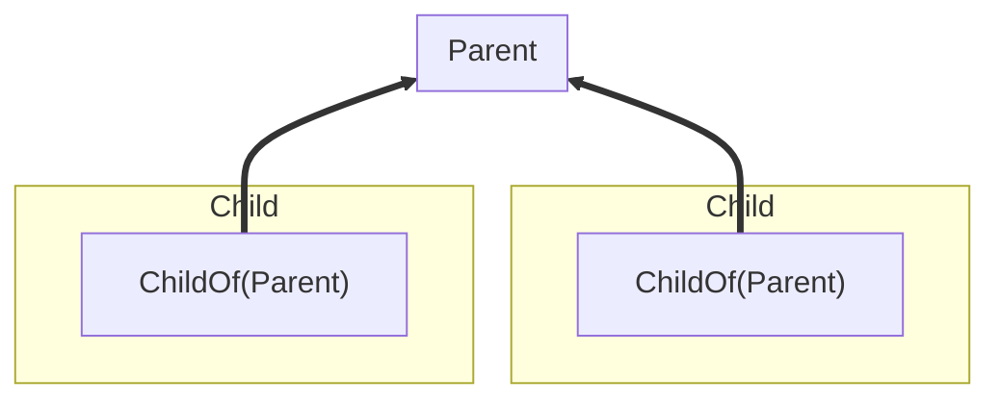

Koota supports relations between entities using the `relation` function. Relations allow you to build graphs by creating connections between entities with efficient queries.

## Relations basics

```js
const ChildOf = relation()

const parent = world.spawn()
const child = world.spawn(ChildOf(parent))

const entity = world.queryFirst(ChildOf(parent)) // Returns child
```

A relation is typically owned by the entity that needs to express it. The **source** is the entity that has the relation added, and the **target** is the entity it points to.



In `child.add(ChildOf(parent))`, child is the source and parent is the target. This design means the parent doesn't need to know about its children, instead children care about their parent, optimizing batch queries.

## Relations with data

Relations can contain data like any trait.

```js
const Contains = relation({ store: { amount: 0 } })

const inventory = world.spawn()
const gold = world.spawn()

// Pass initial data when adding
inventory.add(Contains(gold, { amount: 10 }))

// Update data with set
inventory.set(Contains(gold), { amount: 20 })

// Read data with get
const data = inventory.get(Contains(gold)) // { amount: 20 }
```

## Auto destroy

Relations can automatically destroy related entities when their counterpart is destroyed using the `autoDestroy` option.

### Destroy orphans

When a target is destroyed, destroy all sources pointing to it. This is commonly used for hierarchies when you want to clean up any detached graphs. It can be enabled with the `'orphan'` or `'source'` option.

```js
const ChildOf = relation({ autoDestroy: 'orphan' }) // Or 'source'

const parent = world.spawn()
const child = world.spawn(ChildOf(parent))
const grandchild = world.spawn(ChildOf(child))

parent.destroy()

world.has(child) // False, the child and grandchild are destroyed too
```

### Destroy targets

When a source is destroyed, destroy all its targets.

```js
const Contains = relation({ autoDestroy: 'target' })

const container = world.spawn()
const itemA = world.spawn()
const itemB = world.spawn()

container.add(Contains(itemA), Contains(itemB))
container.destroy()

world.has(itemA) // False, items are destroyed with container
```

## Relation hooks

Relations take the same definition hooks as traits, `onAdd`, `onSet`, and `onRemove`, with the target as a third argument, plus `onTargetDestroy`. `onTargetDestroy` runs for each source when the target is destroyed, while the target is still readable and before the pair is removed. Once the hook returns, the pair is removed if the source still holds it, and any `autoDestroy` policy applies after the hook.

```js
const Follows = relation({ store: { distance: 0 } })
  .onSet((value) => {
    value.distance = Math.max(0, value.distance)
  })
  .onTargetDestroy((value, follower, leader) => {
    // The leader is still alive here; the pair leaves once this returns
    follower.add(Idle)
  })
```

## Exclusive relations

Exclusive relations ensure each entity can only have one target.

```js
const Targeting = relation({ exclusive: true })

const hero = world.spawn()
const rat = world.spawn()
const goblin = world.spawn()

hero.add(Targeting(rat))
hero.add(Targeting(goblin))

hero.has(Targeting(rat)) // False
hero.has(Targeting(goblin)) // True
```

## Ordered relations

By default the sources of a target have no defined order: `world.query(ChildOf(parent))` returns children in storage order, and removing one can move another. A relation created with `ordered: true` keeps each target's sources in insertion order, the way Flecs's `OrderedChildren` does.

```js
const ChildOf = relation({ ordered: true })

const parent = world.spawn()
const a = world.spawn(ChildOf(parent))
const b = world.spawn(ChildOf(parent))

parent.sourcesFor(ChildOf) // [a, b]
world.query(ChildOf(parent)) // [a, b], the same order

parent.orderSources(ChildOf, [b, a]) // reorder without touching the relation
parent.sourcesFor(ChildOf) // [b, a]
```

Adding a pair appends to the end and removing one keeps the rest in place. `orderSources` takes the complete set of current sources in the new order and throws when the set does not match. Ordering costs one list append per add and one list splice per remove on that relation, and nothing on relations without the flag.

## Querying relations

Relations can be queried with specific targets and wildcard targets using `*`.

```js
const gold = world.spawn()
const silver = world.spawn()
const inventory = world.spawn(Contains(gold), Contains(silver))

const targets = inventory.targetsFor(Contains) // Returns [gold, silver]

const chest = world.spawn(Contains(gold))

const containsSilver = world.query(Contains(silver)) // Returns [inventory]
const containsAnything = world.query(Contains('*')) // Returns [inventory, chest]
```

## Relation filters

A query nested in a relation can be used to filter target entities instead of naming one specific target. Use them when you want to ask for relations pointing at "any player", "any active parent", or "any rare item".

```js
const IsRare = trait()

silver.add(IsRare)

const containsRareItems = world.query(Contains(IsRare))
const equippedOnAngryGoblin = world.query(EquippedOn(Goblin, IsAngry))
```

## Removing relations

A relation targets a specific entity, so we need to likewise remove relations with specific entities.

```js
// Add a specific relation
player.add(Likes(apple))
player.add(Likes(banana))

// Remove that same relation
player.remove(Likes(apple))

player.has(apple) // false
player.has(banana) // true
```

However, a wildcard can be used to remove all relations of a kind — for all targets — from an entity.

```js
player.add(Likes(apple))
player.add(Likes(banana))

// Remove all Likes relations
player.remove(Likes('*'))

player.has(apple) // false
player.has(banana) // false
```

## Tracking relation changes

Relations work with tracking modifiers to detect when entities gain, lose, or update relations. Changes can only be tracked on relations that have a store.

```js
import { createAdded, createRemoved, createChanged } from 'koota'

const Added = createAdded()
const Removed = createRemoved()
const Changed = createChanged()

const ChildOf = relation({ store: { priority: 0 } })

// Track when any entity adds the ChildOf relation
const newChildren = world.query(Added(ChildOf))

// Track when any entity removes the ChildOf relation
const orphaned = world.query(Removed(ChildOf))

// Track when relation data changes for any target
const updated = world.query(Changed(ChildOf))
```

> [!IMPORTANT]  
> Tracking modifiers do not accept pairs directly such as `Changed(ChildOf(parent))`. Instead, pass the base relation to the modifier and add the pair as a separate query parameter to filter by target.

```js
const parent = world.spawn()

// Filter changed entities by a specific target
const changedChildren = world.query(Changed(ChildOf), ChildOf(parent))

// Filter changed entities with a relation filter
const changedPlayerChildren = world.query(Changed(ChildOf), ChildOf(IsPlayer, IsActive))
```

## Relation events

Relations emit events per **pair**. This makes it easy to know exactly which target was involved.

- `onAdd(Relation, (entity, target) => {})` triggers when `entity.add(Relation(target))` is called.
- `onRemove(Relation, (entity, target) => {})` triggers when `entity.remove(Relation(target))` is called.
- `onChange(Relation, (entity, target) => {})` triggers when relation **store data** is updated with `entity.set(Relation(target), data)` or supplied when the pair is added (only for relations created with a `store`).

```js
const ChildOf = relation({ store: { priority: 0 } })

const unsubAdd = world.onAdd(ChildOf, (entity, target) => {})
const unsubRemove = world.onRemove(ChildOf, (entity, target) => {})
const unsubChange = world.onChange(ChildOf, (entity, target) => {})

const parent = world.spawn()
const child = world.spawn()

child.add(ChildOf(parent)) // onAdd(child, parent)
child.set(ChildOf(parent), { priority: 1 }) // onChange(child, parent)
child.remove(ChildOf(parent)) // onRemove(child, parent)
```

Hooks also accept **relation pairs** for target-specific filtering. `ChildOf(parent)` only fires for that specific target, while `ChildOf('*')` fires for any target (equivalent to passing the relation itself).

```js
// Only fires when a ChildOf relation to this specific parent is added
world.onAdd(ChildOf(parent), (entity, target) => {})

// Fires for any ChildOf addition, the same as passing the ChildOf trait
world.onAdd(ChildOf('*'), (entity, target) => {})
```
