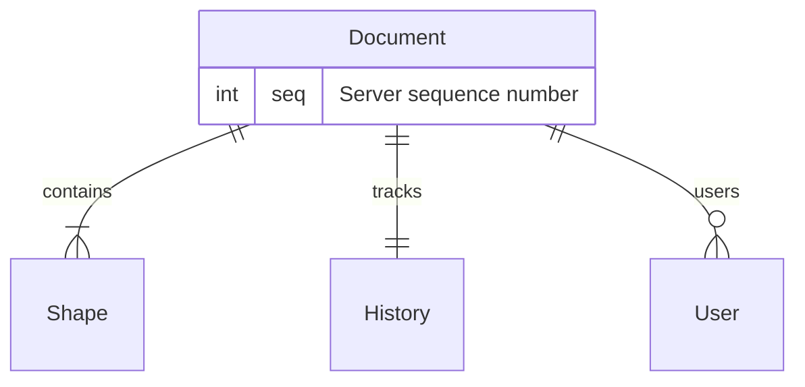
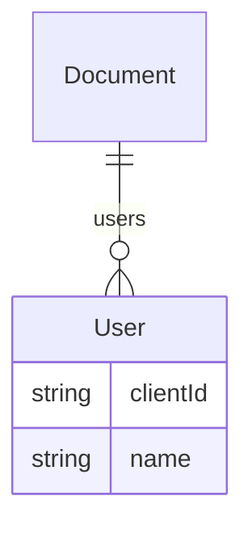
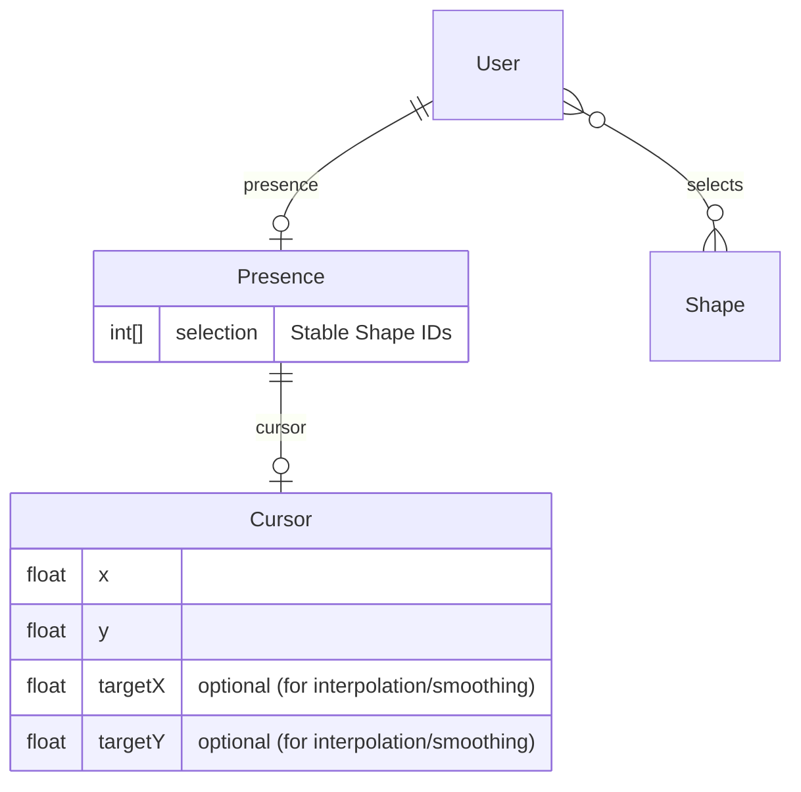
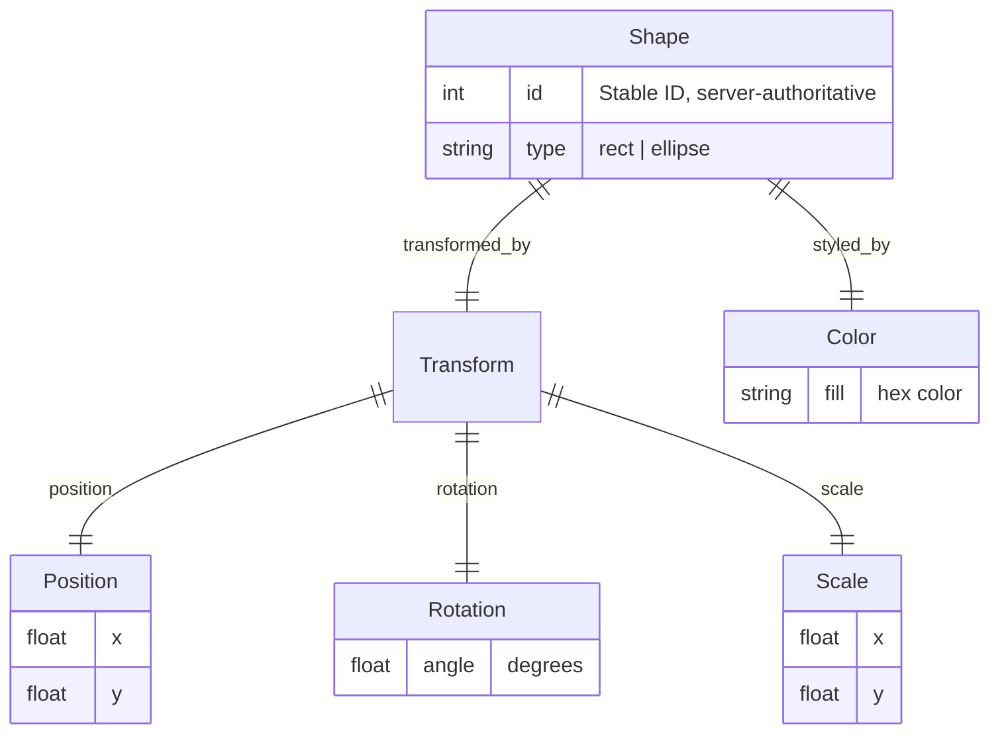

# Multiplayer Editor Data Model

## How to read

The data model describes how data is related and what properties it has. It serves as a contract between all platforms. It is **not** a platform-specific implementation, whether in a database or in memory.

Implementations may differ. For example, an in-memory implementation may optimize for read/write performance, pack data into contiguous buffers, or implement only a subset of the model. Regardless of implementation, the defined relationships must hold, and any implemented data must respect the model.

The data model is a living document. Some areas may be underspecified to allow for prototyping or to avoid prematurely fixing details.

## Document

At the root is the Document. A document contains shapes and is synchronized across clients via checkpoints and semantic operations.

## User

A Document has zero or more Users. A User represents a collaborator in the session, identified by `clientId`.

### Presence

Presence represents the collaboration state like cursor position and selection.

## Shape

Shapes are the primary content entities. Each shape has a stable ID for cross-client references and supports transformation and color.

