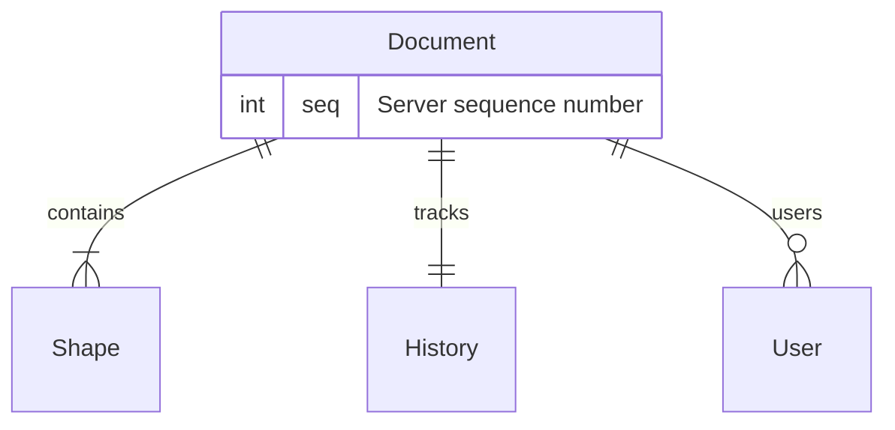
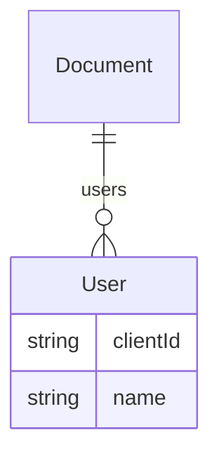
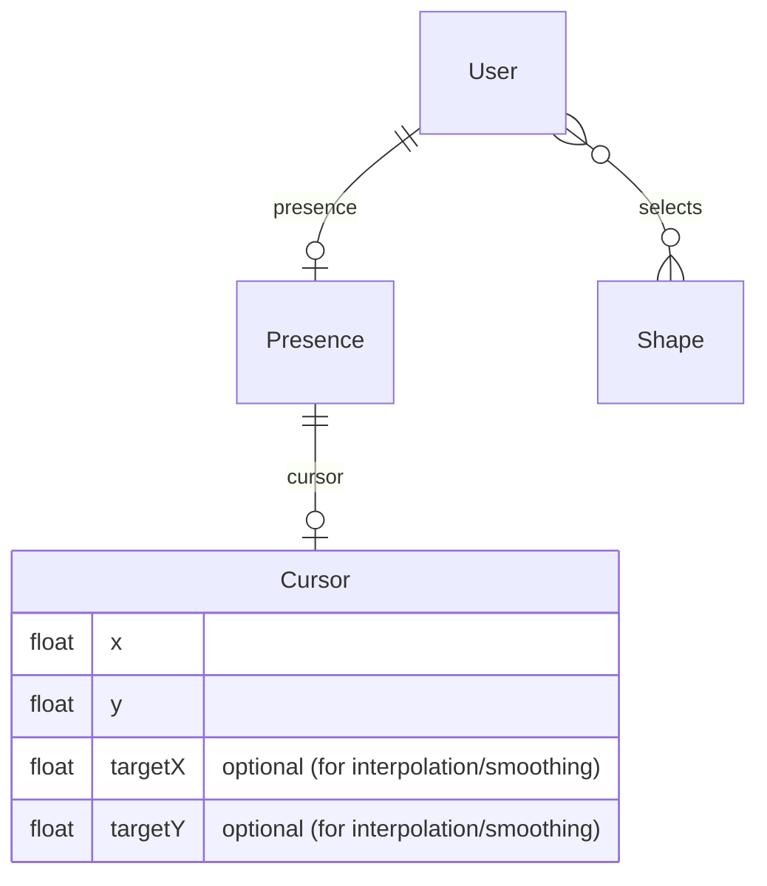
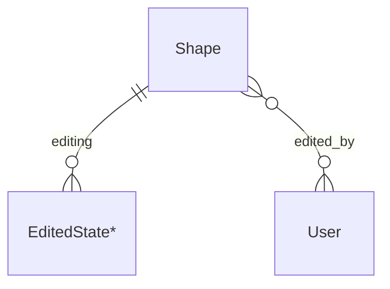
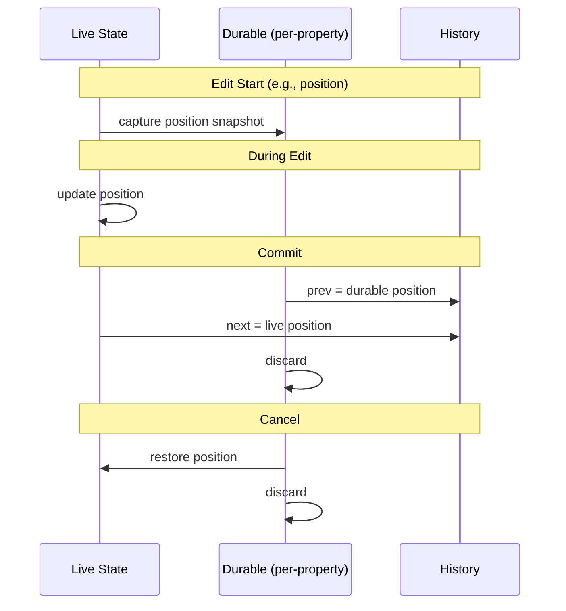
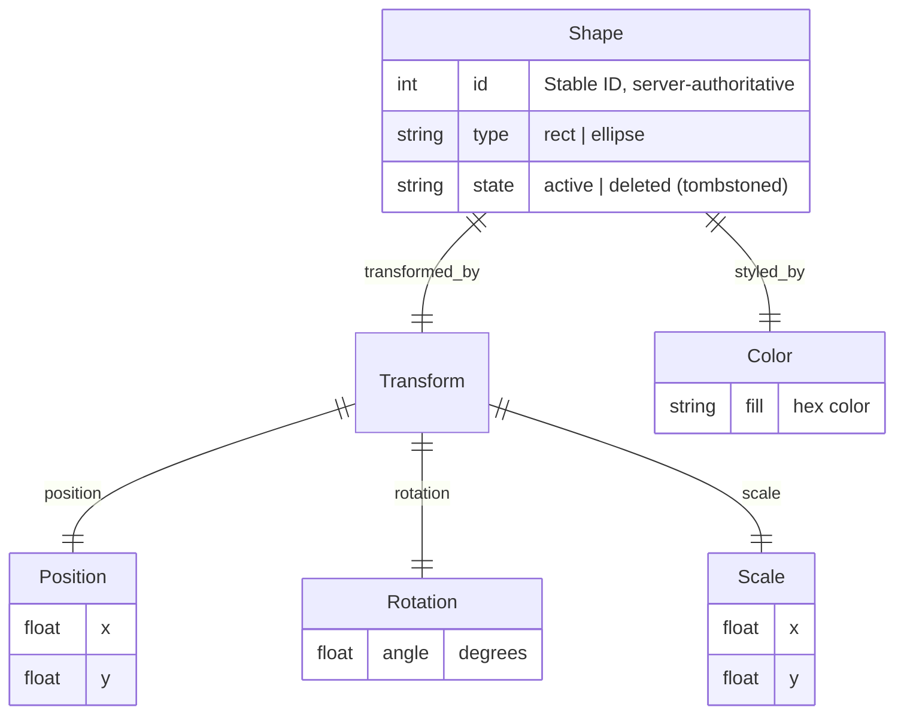

# Multiplayer Editor Data Model

## How to read

The data model describes how data is related and what properties it has. It serves as a contract between all platforms. It is **not** a platform-specific implementation, whether in a database or in memory.

Implementations may differ. For example, an in-memory implementation may optimize for read/write performance, pack data into contiguous buffers, or implement only a subset of the model. Regardless of implementation, the defined relationships must hold, and any implemented data must respect the model.

The data model is a living document. Some areas may be underspecified to allow for prototyping or to avoid prematurely fixing details.

## Document

At the root is the Document. A document contains shapes and is synchronized across clients via checkpoints and semantic operations.

## User

A Document has zero or more Users. A User represents a collaborator in the session, identified by `clientId`.

### Presence

Presence represents the collaboration state like cursor position and selection.

### Editing State

When a shape is being edited, the shape maintains two parallel states:

1. **Live state**: Current property values, always reflecting the visual state.
2. **Durable state** (per-property): Snapshot of a property's value when editing began.

`edited_by` is a **non-exclusive** relationship: multiple users may be editing the same shape at the same time.

#### Editing States

Each property has its own editing state representing the durable state in the editing lifecycle. Properties can be edited independently or together. For example, a drag edits position only, while a transform handle might edit rotation and scale simultaneously.

- **EditingPosition**: `{ durableX: float, durableY: float, targetX: float, targetY: float }`
- **EditingRotation**: `{ durableAngle: float, targetAngle: float }`
- **EditingScale**: `{ durableX: float, durableY: float, targetX: float, targetY: float }`
- **EditingColor**: `{ durableFill: string }`

The `target*` fields are used for remote interpolation during drag operations.

#### Data Flow

On edit start, live values are captured into durable state; during editing, live values change; on commit, an op is created from durable → live and durable is discarded; on cancel, live is restored from durable and durable is discarded. Remote edits follow the same lifecycle, with edit start/update/end messages representing those steps.

#### Relationship to Ops

- **Durable** = property value at the last committed op
- **Ops** are created per-property with `prev` (durable) and `next` (live) values
- **Cancel** restores to the last committed state

Notes:

- Live state always reflects the current visual state for all clients.
- Concurrent edits are allowed across different properties. If multiple users edit the same property at the same time, last write wins.
- Editing is distinct from selection—selecting a shape does not imply editing it.

## Shape

Shapes are the primary content entities. Each shape has a stable ID for cross-client references and supports transformation and color.

### Shape lifecycle

Deleting a shape marks it as `state = deleted` (tombstoned) but preserves its identity and last
known properties. Systems that operate on visible or interactive shapes should target only
`state = active` shapes. Undoing a delete clears the tombstone and restores the shape to active.
