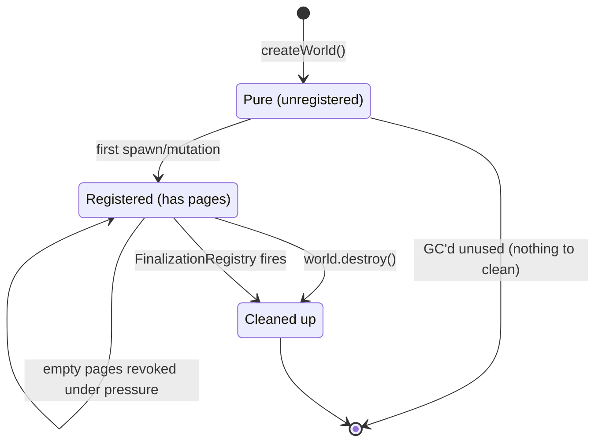
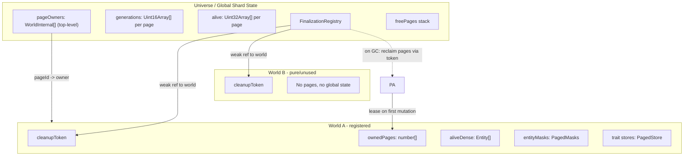
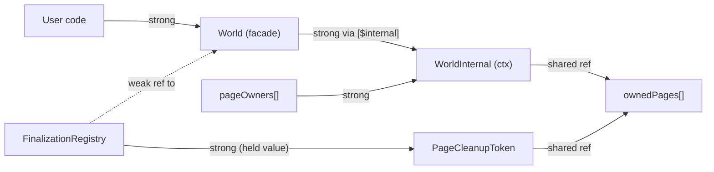

# Global Page-Based Entity Index

## Goals

- Remove the hard 16-world limit so arbitrary service instances can run on one shard.
- Remove `worldId` from the packed entity format, eliminating world identity from entity values.
- Make `createWorld()` pure -- zero global side effects, no `init()` API required.
- Self-cleaning page allocator: pages revoked under pressure or when worlds are GC'd via `FinalizationRegistry`.
- Works safely with React strict mode (double-mount/unmount) without leaking global state.
- Keep the total entity budget at ~1M (20-bit entity IDs), shared across all worlds.
- Align page geometry with `HiSparseBitSet` block structure (1024-entity pages).
- Avoid holey flat arrays by converting all per-entity storage to paged storage.
- Preserve O(1) entity-to-world lookup performance.

## Budget and Limits

| Resource                                    | Limit              | Determined by                                             |
| ------------------------------------------- | ------------------ | --------------------------------------------------------- |
| Total entities (all worlds)                 | 1,048,576 (~1M)    | 20-bit entity ID                                          |
| Entity pages                                | 1,024              | 20-bit entity ID / 10-bit page size                       |
| Active worlds (with >= 1 entity)            | 1,024 (worst case) | Each world leases at least one page; 1024 pages available |
| Active worlds (typical, ~1k entities each)  | ~1,000             | 1 page per world minimum                                  |
| Active worlds (typical, ~10k entities each) | ~100               | ~10 pages per world                                       |
| Unused worlds (never spawned)               | Unlimited          | No pages leased, only JS heap cost                        |
| Generation counter per entity               | 0..4095            | 12-bit generation                                         |

The hard ceiling is 1,024 active worlds (one page each, every world has exactly 1 entity). In practice the constraint is the shared ~1M entity budget, not world count. Unused worlds cost nothing.

## New Entity Format

Reclaim the 4 world bits for generation:

```
Current:  worldId(4) + generation(8) + entityId(20) = 32 bits
New:      generation(12) + entityId(20) = 32 bits
```

- `getEntityId(entity)` = `entity & 0xFFFFF`
- `getEntityGeneration(entity)` = `entity >>> 20`
- Generation range 0..4095 (vs current 0..255) = much safer recycling.

File: [pack-entity.ts](packages/core/src/entity/utils/pack-entity.ts) -- remove `WORLD_ID_BITS`, `WORLD_ID_MASK`, `WORLD_ID_SHIFT`, `getEntityWorldId`, `getEntityAndWorldId`. Update `packEntity` to take only `(generation, entityId)`.

## Page Geometry

Aligned with `HiSparseBitSet` L2 block structure:

- `PAGE_BITS = 10`, `PAGE_SIZE = 1024`, `PAGE_MASK = 1023`
- `MAX_PAGES = 1024` (covers 1,048,576 entity IDs)
- `pageId = entityId >>> 10`, `offset = entityId & 1023`

One `HiSparseBitSet` L2 block maps to exactly one page.

## World Lifecycle Model



- `createWorld()` allocates the JS object only. No global state touched. No `init()` call needed.
- First mutation (e.g. `spawn()`) triggers lazy self-registration: lease pages, register in universe, set up tracking masks.
- `world.destroy()` is the explicit fast-cleanup path: destroys entities, releases pages, unregisters.
- If the world reference is dropped without `destroy()`, `FinalizationRegistry` eventually reclaims all its pages.
- If a world is created but never used (no `spawn()`), it is never registered and nothing leaks on GC.

## Architecture



## Self-Cleaning Page Allocator

New file: `packages/core/src/entity/utils/page-allocator.ts`

```ts
type PageCleanupToken = {
  ownedPages: number[] // mutated by world as pages are leased/released
  registered: boolean // false until first mutation
}

// pageOwners hoisted to universe top level for minimal property-chain depth
// in entity method dispatch: universe.pageOwners[pageId]
type PageAllocator = {
  generations: (Uint16Array | null)[] // pageId -> 1024 generation values
  alive: (Uint32Array | null)[] // pageId -> 32 words (1024 alive bits)
  freePages: number[] // stack of unleased page IDs
  pageCursor: number // next fresh pageId
  worldFinalizer: FinalizationRegistry<PageCleanupToken>
}
```

### Page leasing

- `leasePage(allocator, owner)`: pop from `freePages`, or try pressure revocation, or advance `pageCursor`. Set `pageOwners[pageId] = owner`. Allocate `generations[pageId]` and `alive[pageId]` if not already allocated.
- Called lazily on first `spawn()`, not during `createWorld()`.

### Pressure-based revocation

When `freePages` is empty and `pageCursor === MAX_PAGES`:

```ts
function reclaimEmptyPages(allocator: PageAllocator, needed: number): number {
  let reclaimed = 0
  for (let pageId = 0; pageId < allocator.pageCursor && reclaimed < needed; pageId++) {
    if (allocator.pageOwners[pageId] === null) continue
    if (isPageEmpty(allocator.alive[pageId]!)) {
      revokePageFromOwner(allocator, pageId)
      allocator.freePages.push(pageId)
      reclaimed++
    }
  }
  return reclaimed
}
```

A page is "empty" when all 32 alive words are zero (no living entities). The owning world discovers revocation lazily on its next allocation attempt and leases a fresh page.

### FinalizationRegistry cleanup

```ts
const worldFinalizer = new FinalizationRegistry<PageCleanupToken>((token) => {
  if (!token.registered) return // never used, nothing to clean
  for (const pageId of token.ownedPages) {
    clearAliveBits(allocator, pageId) // kill any remaining entities
    allocator.pageOwners[pageId] = null
    allocator.freePages.push(pageId)
  }
  token.ownedPages.length = 0
})
```

The `PageCleanupToken` is a plain object that:

- The world mutates (updates `ownedPages` as pages are leased/released).
- Does NOT reference the world back (so the world can be GC'd).
- The FR callback receives the token and uses it to reclaim pages.

Registration happens inside `createWorld()`:

```ts
function createWorld() {
  const cleanupToken: PageCleanupToken = { ownedPages: [], registered: false }
  const world = {
    /* ... */
  }
  universe.pageAllocator.worldFinalizer.register(world, cleanupToken)
  return world
}
```

This is the only thing `createWorld()` does to global state: one FR registration, which is unobservable and requires no cleanup.

### Lazy self-registration

The world tracks an `isRegistered` flag (initially false). On first mutation:

```ts
function ensureWorldRegistered(world: World) {
  if (world[$internal].isRegistered) return
  world[$internal].isRegistered = true
  world[$internal].cleanupToken.registered = true
  universe.worlds.add(world)

  // Set up tracking masks for any existing tracking modifiers
  const cursor = getTrackingCursor()
  for (let i = 0; i < cursor; i++) {
    setTrackingMasks(world, i)
  }
}
```

Called at the top of `spawn()`, `add()` on world, `query()`, etc.

### React strict mode behavior

```
1. render:  createWorld()         -> pure, only FR.register (unobservable)
2. effect:  world.spawn(...)      -> lazy registration, lease pages
3. cleanup: world.destroy()       -> explicit cleanup, release pages, unregister
4. effect:  world.spawn(...)      -> re-registers, leases new pages
```

If the user forgets `destroy()`:

```
1. render:  createWorld()         -> FR.register
2. effect:  world.spawn(...)      -> registered
3. (component unmounts, world reference dropped)
4. GC collects world              -> FR fires, pages reclaimed
```

If the user creates a world and never uses it:

```
1. render:  createWorld()         -> FR.register (token.registered = false)
2. (world reference dropped)
3. GC collects world              -> FR fires, token.registered is false, no-op
```

## Per-World Entity Allocator

Replace [entity-index.ts](packages/core/src/entity/utils/entity-index.ts) with page-aware allocation:

```ts
type WorldEntityIndex = {
  ownedPages: number[] // dense list of leased page IDs (same array as cleanupToken.ownedPages)
  currentPage: number // page we're currently allocating from (-1 if none)
  aliveDense: Entity[] // dense list of alive entities (for world.entities)
  aliveCount: number
}
```

- `allocateEntity(world)`:
  1. `ensureWorldRegistered(world)`.
  2. Find a free slot in `currentPage` via `ctz32` scan of alive words (inverted).
  3. If full, pick next owned page with capacity; if none, lease a new page.
  4. Set alive bit, init generation, pack entity, push to `aliveDense`.
- `releaseEntity(world, entity)`:
  1. Clear alive bit, bump generation, swap-remove from `aliveDense`.
  2. Page stays owned (lazy release). Empty pages become candidates for pressure revocation.
- `isEntityAlive(entity)`:
  1. Check alive bit at `universe.alive[pageId][offset >>> 5] & (1 << (offset & 31))`.
  2. Compare generation: `universe.generations[pageId][offset] === getEntityGeneration(entity)`.

## World / WorldInternal Split for GC

The World facade (returned by `createWorld()`) must be GC-able when the user drops it. If the universe holds a strong reference to the facade, the finalizer never fires. The solution is to split ownership:



- `pageOwners[pageId]` stores `WorldInternal`, **not** the `World` facade.
- `universe.worldContexts` (replaces `universe.worlds`) is a `Set<WorldInternal>`.
- `WorldInternal` has **no** back-reference to the `World` facade.
- `PageCleanupToken` has **no** reference to either `World` or `WorldInternal`, only the shared `ownedPages` array.
- The only weak reference is inside the `FinalizationRegistry` itself (to the `World` facade).

When user code drops the `World` facade, no strong path from universe keeps it alive. GC collects it, the finalizer fires, and the token's `ownedPages` are used to reclaim pages and tear down the `WorldInternal`.

### Refactor internal functions to take WorldInternal

Currently every internal function takes `World` and immediately destructures it:

```ts
function addTrait(world: World, entity: Entity, ...traits) {
  const ctx = world[$internal] // first line, every time
  // ... rest uses ctx exclusively
}
```

Refactor all internal functions to take `WorldInternal` directly:

```ts
function addTrait(ctx: WorldInternal, entity: Entity, ...traits) {
  // uses ctx directly, no [$internal] lookup
}
```

This is a mechanical refactor: ~20 source files, every function already does `world[$internal]` on line 1. The public `World` facade methods translate:

```ts
const world = {
  spawn(...traits) {
    return createEntity(world[$internal], ...traits)
  },
  add(...traits) {
    addTrait(world[$internal], world[$internal].worldEntity, ...traits)
  },
  // etc.
}
```

Entity convenience methods (`entity.add()`, `entity.get()`) resolve `WorldInternal` directly from `pageOwners`, never touching the `World` facade:

```ts
Number.prototype.add = function (this: Entity, ...traits) {
  const ctx = universe.pageAllocator.pageOwners[getEntityId(this) >>> 10]!
  addTrait(ctx, this, ...traits)
}
```

**No `WeakRef.deref()` anywhere in any code path.** The `World` facade is only held by user code. Internal operations work exclusively with `WorldInternal`.

## World-to-Context Lookup

Replace `getEntityWorld` in [entity.ts](packages/core/src/entity/entity.ts) with a context-only lookup:

```ts
function getEntityContext(entity: Entity): WorldInternal {
  return universe.pageAllocator.pageOwners[getEntityId(entity) >>> 10]!
}
```

One shift + one array load. Same cost as current `universe.worlds[worldId]`. No WeakRef involved.

## Paged Per-World Storage

### Entity Bitmasks

Current type in [world/types.ts](packages/core/src/world/types.ts):

- `entityMasks: number[][]` where `entityMasks[generationId][eid]`

New type:

- `entityMasks: Uint32Array[][]` where `entityMasks[generationId][pageId]` is a `Uint32Array(1024)` or `EMPTY_MASK_PAGE` sentinel.
- Unallocated slots point to a shared frozen `EMPTY_MASK_PAGE = Object.freeze(new Uint32Array(1024))`.
- Type is always `Uint32Array[]` (never null entries) -- monomorphic inline caches.

Read path (branchless):

```ts
const entityMask = ctx.entityMasks[generationId][eid >>> 10][eid & 1023]
```

Write path (ensurePage guard, one-time per page):

```ts
const page = ensureMaskPage(ctx.entityMasks[generationId], eid >>> 10)
page[eid & 1023] |= bitflag
```

Same sentinel pattern for `dirtyMasks`, `changedMasks`, `trackingSnapshots`, and tracking group `trackers`.

### Trait Stores

Current stores in [stores.ts](packages/core/src/storage/stores.ts) are flat arrays. Generated accessors in [accessors.ts](packages/core/src/storage/accessors.ts) use `store.key[index]`.

New SoA store shape: `store.key` is `(unknown[] | null)[]` -- array of pages, each page is `unknown[1024]` or `null`.

Update generated accessor code:

```ts
// Before:
store.${key}[index] = value.${key};
// After:
store.${key}[index >>> 10][index & 1023] = value.${key};
```

For AoS stores: same page indirection on the outer array.

Pages are allocated lazily when a trait is first set on an entity in that page. A helper `ensurePage(store, pageId)` creates the page array on first access.

### Relation Storage

In [relation.ts](packages/core/src/relation/relation.ts), `relationTargets[eid]`, `store[eid]`, and `store[key][eid]` all become paged:

- `relationTargets[pageId][offset]`
- `store[pageId][offset]` (AoS)
- `store[key][pageId][offset]` (SoA)

## Tracking Masks

In [tracking-cursor.ts](packages/core/src/query/utils/tracking-cursor.ts), replace `structuredClone(ctx.entityMasks)` with a manual paged clone that preserves sentinel references:

```ts
function clonePagedMasks(masks: Uint32Array[][]): Uint32Array[][] {
  return masks.map((gen) =>
    gen.map((page) => (page === EMPTY_MASK_PAGE ? EMPTY_MASK_PAGE : new Uint32Array(page)))
  )
}
```

Zeroed dirty/changed masks can be built by filling with `EMPTY_MASK_PAGE` sentinels (all zeros, never mutated on read). Write-path `ensureMaskPage` will materialize individual pages on first dirty/changed write.

## Query Modifiers

[added.ts](packages/core/src/query/modifiers/added.ts), [removed.ts](packages/core/src/query/modifiers/removed.ts), [changed.ts](packages/core/src/query/modifiers/changed.ts) iterate `universe.worlds` to call `setTrackingMasks`. Updated to iterate `universe.worldContexts` (`Set<WorldInternal>`) of registered world contexts. Internal `setTrackingMasks` takes `WorldInternal` after the internal refactor.

## World Lifecycle Changes

- [world-index.ts](packages/core/src/world/utils/world-index.ts): remove entirely. No more world ID allocation.
- [createWorld](packages/core/src/world/world.ts): pure construction. No `allocateWorldId`, no `universe.worlds` mutation, no `init()`. Only `FinalizationRegistry.register()`. Remove the `lazy` option and `init()` method from the API.
- `world.destroy()`: explicit fast-cleanup path. Destroys remaining entities, releases pages, unregisters from universe, calls `FinalizationRegistry.unregister()`.
- `world.reset()`: destroys all entities (pages become empty, eligible for revocation), re-leases fresh pages.
- `world.id`: auto-increment counter for debugging only. Not packed into entities.

## Increment Bitflag

[increment-world-bit-flag.ts](packages/core/src/world/utils/increment-world-bit-flag.ts) pushes a new `[]` to `entityMasks` on overflow. With paged masks, it pushes a new empty paged-mask tier: `[]` (array of null pages). No structural change.

## Public API Breaking Changes

- `unpackEntity` no longer returns `worldId`.
- `getEntityWorldId` / `getEntityAndWorldId` removed from exports.
- `world.id` semantics change (debug-only counter, not packed into entities).
- `world.init()` removed. `lazy` option removed from `WorldOptions`.
- Entity test in [entity.test.ts](packages/core/tests/entity.test.ts) that asserts `worldId` from `unpackEntity` must be rewritten.
- World test that asserts max-16-worlds limit must be rewritten.

## V8 Performance Optimizations

### Sentinel empty pages (critical)

All paged mask arrays (`entityMasks`, `dirtyMasks`, `changedMasks`, `trackingSnapshots`, tracking group `trackers`) must use a shared frozen sentinel instead of `null` for unallocated pages:

```ts
const EMPTY_MASK_PAGE = Object.freeze(new Uint32Array(1024))
```

This eliminates null-check branches on every read-path access (checkQuery, checkQueryTracking, hasTrait) and keeps the type monomorphic (`Uint32Array[]`, never `(Uint32Array | null)[]`). V8's TurboFan sees a stable inline cache shape. `Uint32Array` also never returns `undefined`, so the `| 0` coercion trick in `checkQueryTracking` becomes unnecessary.

Reads become branchless:

```ts
const entityMask = ctx.entityMasks[generationId][eid >>> 10][eid & 1023]
```

Writes use an `ensurePage` guard (only on the write path, which is less hot):

```ts
function ensureMaskPage(masks: Uint32Array[], pageId: number): Uint32Array {
  let page = masks[pageId]
  if (page === EMPTY_MASK_PAGE) {
    page = new Uint32Array(1024)
    masks[pageId] = page
  }
  return page
}
```

The branch is taken once per page materialization; after that, the branch predictor skips it.

### Hoist page/offset in generated accessors (critical)

The generated SoA accessor functions in [accessors.ts](packages/core/src/storage/accessors.ts) run per-entity per-trait-key in `readEach`/`updateEach`. The page/offset must be computed once, not per key:

```ts
// Generated get (example: Position with x, y)
const p = index >>> 10,
  o = index & 1023
return { x: store.x[p][o], y: store.y[p][o] }

// Generated fastSet
const p = index >>> 10,
  o = index & 1023
store.x[p][o] = value.x
store.y[p][o] = value.y

// Generated fastSetWithChangeDetection
const p = index >>> 10,
  o = index & 1023
let changed = false
if (store.x[p][o] !== value.x) {
  store.x[p][o] = value.x
  changed = true
}
if (store.y[p][o] !== value.y) {
  store.y[p][o] = value.y
  changed = true
}
return changed
```

V8 cannot be relied on to CSE `index >>> 10` across separate property chains (`store.x[...]` vs `store.y[...]`) in `new Function()` generated code. Hoisting guarantees one shift and one mask regardless of key count.

### Typed arrays for tracking group trackers

Tracking group `trackers[genId][eid]` in [check-query-tracking.ts](packages/core/src/query/utils/check-query-tracking.ts) are currently lazily-initialized `number[]` arrays. With paging, these must use `Uint32Array` pages with the same sentinel pattern as entityMasks. This keeps types monomorphic and avoids:

- Polymorphic inline caches from mixed `undefined` / `number` reads
- The `| 0` coercion on every access

### Hoist pageOwners to universe top level

Avoid deep property chain in entity method dispatch. Instead of `universe.pageAllocator.pageOwners[pageId]`, hoist to:

```ts
export const universe = {
  pageOwners: [] as (WorldInternal | null)[],
  // ... rest of allocator state in a sub-object
}
```

Entity context lookup becomes: `universe.pageOwners[pageId]` -- same depth as current `universe.worlds[worldId]`. Combined with the internal refactor (skipping `world[$internal]`), entity methods are net faster than today.

### Manual paged-mask clone for tracking snapshots

Replace `structuredClone(ctx.entityMasks)` in [tracking-cursor.ts](packages/core/src/query/utils/tracking-cursor.ts) with a manual clone that preserves sentinel references:

```ts
function clonePagedMasks(masks: Uint32Array[][]): Uint32Array[][] {
  return masks.map((gen) =>
    gen.map((page) => (page === EMPTY_MASK_PAGE ? EMPTY_MASK_PAGE : new Uint32Array(page)))
  )
}
```

This avoids cloning immutable sentinel pages and is faster than `structuredClone`'s generic algorithm. Zeroed dirty/changed masks reuse sentinel directly.

## Other Performance Considerations

1. **Cache locality**: entities from the same world are allocated from the same pages. Within a query iteration, `eid >>> 10` produces the same pageId for runs of consecutive entities. The inner `Uint32Array` page stays in L1/L2 cache. Fixed-size typed array pages have better cache behavior than growable holey JS arrays.

2. **SparseSet stays as-is**: with ~1M budget, packed entity values are bounded. Generation-0 entities pack to values 0..1M (dense-ish in V8). Recycled entities get larger but this is the same behavior as today.

3. **Allocation hot path**: page-local free-bit scan via `ctz32` on inverted alive words. Same primitive already in `HiSparseBitSet`. Worst case 32 words to scan per page.

4. **Pressure revocation cost**: linear scan of `pageOwners` (max 1024 entries). Only triggered when truly out of pages. Amortized over many allocations.

5. **FinalizationRegistry overhead**: one registration per world, one callback per GC'd world. Zero hot-path cost (no WeakRef.deref() anywhere).

6. **Lazy registration overhead**: one `isRegistered` boolean check per mutation entry point. Branch predictor handles this after the first call.

7. **Relation reverse lookup** in `getEntitiesWithRelationTo` is already O(N). Global IDs don't make it worse, but this is a pre-existing bottleneck worth a follow-up reverse index.

8. **Net entity-method speedup**: current path is `getEntityWorldId` (shift) -> `universe.worlds[id]` (load) -> `world[$internal]` (property access). New path is `getEntityId` (mask) -> shift -> `universe.pageOwners[pageId]` (load). One fewer property access; internal functions take `WorldInternal` directly.

## Migration Order

Sequenced to minimize intermediate breakage; each phase produces a passing test suite before the next begins.
