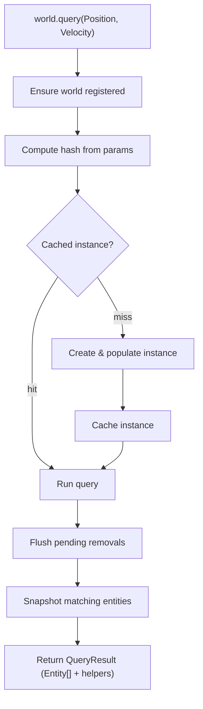

# Query

## Query Resolution

How `world.query(...)` resolves inline trait refs into a result.

### Trait ref params

This is the most common path. The user passes trait refs directly as arguments.

```
world.query(Position, Velocity)
```

### Flow



### Steps

**1. Query**

```ts
world.query(Position, Velocity)
```

Trait refs are passed as arguments to `world.query`. Each ref carries a stable numeric ID used for hashing.

**2. Ensure world registered**

```ts
const ctx = world[$internal]
ensureWorldRegistered(ctx, world, id)
```

Querying is also a registration point. If the world has not been used yet, this step registers it, initializes tracking masks, and creates the world entity.

**3. Compute hash**

```ts
const hash = createQueryHash(params)
```

Trait IDs are sorted and joined into a canonical string key. Parameter order doesn't matter — `query(A, B)` and `query(B, A)` produce the same hash.

**4. Get cached instance**

```ts
let query = ctx.queriesHashMap.get(hash)

if (!query) {
  query = createQueryInstance(ctx, params)
  ctx.queriesHashMap.set(hash, query)
}
```

The hash looks up an existing `QueryInstance`. On a miss a new instance is created: it processes the parameters, builds bitmasks, and populates matching entities via bitmask checks against all live entities. The instance is then cached for future calls.

**5. Run**

```ts
query.run(ctx, params)
```

Flushes any deferred removals, then snapshots the instance's entity set. For tracking queries (e.g. `Added`, `Removed`, `Changed`) the set is cleared and bitmasks reset so changes can accumulate again before the next call.

**6. Return result**

```ts
return createQueryResult(ctx, entities, query, params)
```

The entity snapshot is wrapped in a `QueryResult` — an array with additional methods for iterating with trait data — and returned to the caller.

## Important details

- Query instances are cached two ways: by canonical hash in `ctx.queriesHashMap`, and for pre-built query refs by numeric `queryRef.id` in `ctx.queryInstances`. The second path avoids recomputing the same hash lookup for shared query refs.
- Query matching is incremental after creation. Structural changes do not rebuild every query from scratch; they update only the queries affected by the touched trait or relation.

## Fast paths

- A shared query ref created ahead of time can resolve directly through `queryRef.id`.
- A single relation pair with a specific target can skip the general query pipeline and use the relation reverse lookup path directly.

## Tracking queries

Tracking modifiers such as `Added`, `Removed`, and `Changed` build on the same query cache, but they also maintain paged tracking masks and snapshots.

- They use paged tracking masks and snapshots.
- After `query.run(...)`, they clear transient results and reset tracking state.

## Relation filters

Base trait/relation matching is bitmask-driven, but relation pairs are not fully representable in the entity mask, so target-specific filtering is applied as an extra step.
