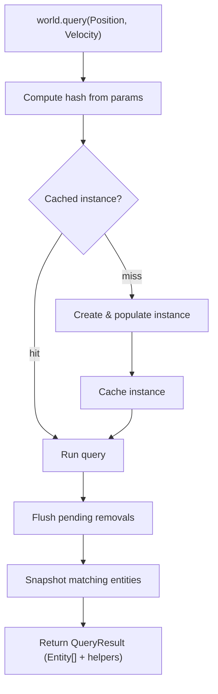

# Query

## Query Resolution

How `world.query(...)` resolves inline trait refs into a result.

### Trait ref params

This is the most common path. The user passes trait refs directly as arguments.

```
world.query(Position, Velocity)
```

### Flow



### Steps

**1. Query**

```ts
world.query(Position, Velocity)
```

Trait refs are passed as arguments to `world.query`. Each ref carries a stable numeric ID used for hashing.

**2. Compute hash**

```ts
const hash = createQueryHash(params)
```

Trait IDs are sorted and joined into a canonical string key. Parameter order doesn't matter — `query(A, B)` and `query(B, A)` produce the same hash.

**3. Get cached instance**

```ts
let query = ctx.queriesHashMap.get(hash)

if (!query) {
  query = createQueryInstance(world, params)
  ctx.queriesHashMap.set(hash, query)
}
```

The hash looks up an existing `QueryInstance`. On a miss a new instance is created: it processes the parameters, builds bitmasks, and populates matching entities via bitmask checks against all live entities. The instance is then cached for future calls.

**4. Run**

```ts
query.run(world, params)
```

Flushes any deferred removals, then snapshots the instance's entity set. For tracking queries (e.g. `Added`, `Removed`, `Changed`) the set is cleared and bitmasks reset so changes can accumulate again before the next call.

**5. Return result**

```ts
return createQueryResult(world, entities, query, params)
```

The entity snapshot is wrapped in a `QueryResult` — an array with additional methods for iterating with trait data — and returned to the caller.
