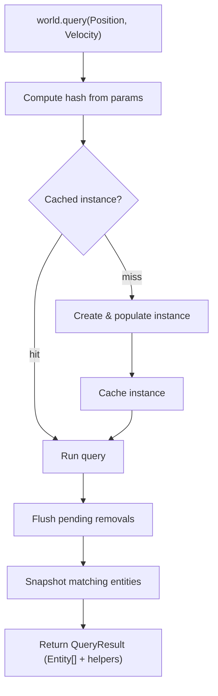
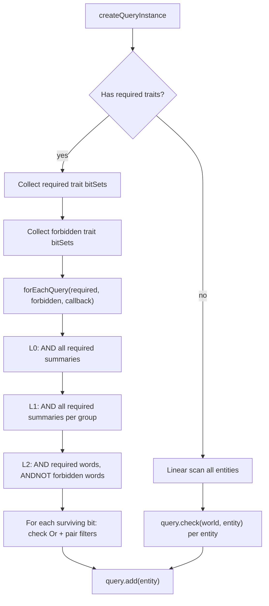
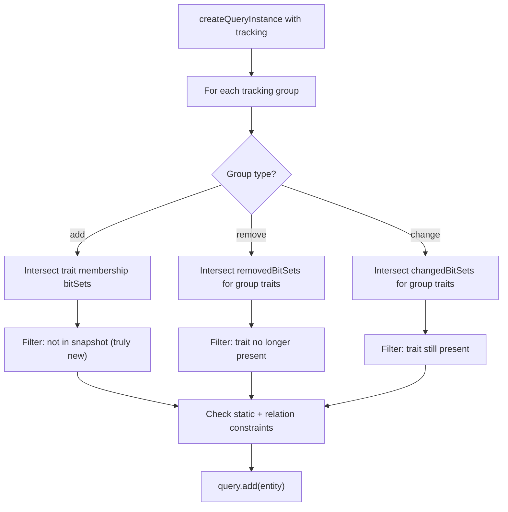

# Query

## Query Resolution

How `world.query(...)` resolves inline trait refs into a result.

### Trait ref params

This is the most common path. The user passes trait refs directly as arguments.

```
world.query(Position, Velocity)
```

### Flow



### Steps

**1. Query**

```ts
world.query(Position, Velocity)
```

Trait refs are passed as arguments to `world.query`. Each ref carries a stable numeric ID used for hashing.

**2. Compute hash**

```ts
const hash = createQueryHash(params)
```

Trait IDs are sorted and joined into a canonical string key. Parameter order doesn't matter — `query(A, B)` and `query(B, A)` produce the same hash.

**3. Get cached instance**

```ts
let query = ctx.queriesHashMap.get(hash)

if (!query) {
  query = createQueryInstance(world, params)
  ctx.queriesHashMap.set(hash, query)
}
```

The hash looks up an existing `QueryInstance`. On a miss a new instance is created: it processes the parameters, builds trait instance lists, and populates matching entities via hierarchical bitset intersection. The instance is then cached for future calls.

**4. Run**

```ts
query.run(world, params)
```

Flushes any deferred removals, then snapshots the instance's entity set. For tracking queries (e.g. `Added`, `Removed`, `Changed`) the set is cleared and tracker bitsets reset so changes can accumulate again before the next call.

**5. Return result**

```ts
return createQueryResult(world, entities, query, params)
```

The entity snapshot is wrapped in a `QueryResult` — an array with additional methods for iterating with trait data — and returned to the caller.

---

## Initial Population

When a `QueryInstance` is first created, it must find all existing entities that match. The strategy differs based on whether the query uses tracking modifiers.

### Non-tracking queries



#### Hierarchical bitset intersection

The core population path uses `forEachQuery()` — a 3-level hierarchical intersection that prunes entire subtrees of the entity ID space:

```ts
const requiredSets = requiredInstances.map((inst) => inst.bitSet)
const forbiddenSets = forbiddenInstances.map((inst) => inst.bitSet)

forEachQuery(requiredSets, forbiddenSets, (eid) => {
  // Check Or traits and pair filters, then add
  if (hasOr) {
    /* at least one Or trait must match */
  }
  if (hasRf) {
    /* pair filters must match */
  }
  query.add(entity)
})
```

**How the hierarchy prunes:**

| Level     | Granularity            | Operation                                  | Effect                                              |
| --------- | ---------------------- | ------------------------------------------ | --------------------------------------------------- |
| L0 (top)  | 32K entity IDs per bit | AND all required L0 masks                  | Skips entire 32K-entity ranges with zero population |
| L1 (mid)  | 1K entity IDs per bit  | AND all required L1 summaries              | Skips 1K-entity blocks                              |
| L2 (data) | 32 entity IDs per word | AND required words, ANDNOT forbidden words | Yields individual matching entity IDs               |

For a world with 100K entities where only 5K match a 3-trait query, the hierarchy skips ~95% of the ID space at L0/L1 without touching L2 data blocks.

### Tracking queries

Tracking queries (those using `Added`, `Removed`, or `Changed` modifiers) use a different population strategy that consults event bitsets:



**Added:** Intersects the membership bitsets of the group's traits, then filters out entities that were already present in the tracking snapshot (taken when the tracking modifier was created).

**Removed:** Intersects the `removedBitSets` for the group's traits, then verifies the trait is actually gone.

**Changed:** Intersects the `changedBitSets` for the group's traits, then verifies the trait is still present.

Each type respects the group's `logic` field — `'and'` uses `forEachIntersection` (all traits must match), `'or'` iterates each trait's bitset independently (any trait match suffices).

---

## Incremental Maintenance

After initial population, queries are maintained incrementally as traits are added/removed/changed. This avoids re-scanning the world on every `world.query()` call.

### Non-tracking query update

When a trait is added or removed, all non-tracking queries registered on that trait are checked:

```ts
// In addTraitToEntity / removeTraitFromEntity:
for (const query of instance.queries) {
  const match = query.check(world, entity)
  if (match) query.add(entity)
  else query.remove(world, entity)
}
```

`query.check()` uses per-trait `bitSet.has(eid)` — an O(1) sparse-array lookup per trait, with no generation loop or bitmask aggregation:

```ts
// Required — ALL must be present
for (let i = 0; i < required.length; i++) {
  if (!required[i].bitSet.has(eid)) return false
}

// Forbidden — NONE must be present
for (let i = 0; i < forbidden.length; i++) {
  if (forbidden[i].bitSet.has(eid)) return false
}

// Or — AT LEAST ONE must be present
if (or.length > 0) {
  let anyOr = false
  for (let i = 0; i < or.length; i++) {
    if (or[i].bitSet.has(eid)) {
      anyOr = true
      break
    }
  }
  if (!anyOr) return false
}
```

### Tracking query update

When a trait event occurs, all tracking queries registered on that trait are checked:

```ts
// In addTraitToEntity / removeTraitFromEntity / markChanged:
for (const query of instance.trackingQueries) {
  const match = query.checkTracking(world, entity, eventType, trait)
  if (match) query.add(entity)
  else query.remove(world, entity)
}
```

`checkQueryTracking` performs three phases:

1. **Static constraints** — same `bitSet.has(eid)` checks as non-tracking queries
2. **Tracker update** — if the event trait belongs to a tracking group and the event type matches, insert the entity into that group's `trackerBitSets[traitIndex]`
3. **Satisfaction check** — for `'and'` groups, all `trackerBitSets[j].has(eid)` must be true; for `'or'` groups, at least one must be true

---

## Deferred Removal

Entity removal from queries is deferred to avoid mutation during iteration:

```ts
export function removeEntityFromQuery(world, query, entity) {
  if (!query.entities.has(entity) || query.toRemove.has(entity)) return
  query.toRemove.add(entity)
  ctx.dirtyQueries.add(query)
  // Notify remove subscriptions immediately
}
```

Removals are flushed at the start of `runQuery`:

```ts
export function commitQueryRemovals(world) {
  for (const query of ctx.dirtyQueries) {
    const raw = query.toRemove.denseRaw
    for (let i = raw.length - 1; i >= 0; i--) {
      query.toRemove.remove(raw.array[i])
      query.entities.remove(raw.array[i])
    }
  }
  ctx.dirtyQueries.clear()
}
```

The `denseRaw` access is zero-copy — it reads the backing array and cursor directly, avoiding the allocation that `dense` (which calls `slice()`) would incur.

---

## QueryResult

`runQuery` produces a `QueryResult` — a frozen `Entity[]` augmented with chainable iteration methods:

| Method                  | Description                                            |
| ----------------------- | ------------------------------------------------------ |
| `readEach(cb)`          | Read trait data per entity (no write-back)             |
| `updateEach(cb, opts?)` | Read + write trait data with optional change detection |
| `useStores(cb)`         | Direct store access for SoA-style bulk operations      |
| `select(...params)`     | Re-bind to different traits without re-querying        |
| `sort(cb?)`             | Sort entities (default: by entity ID)                  |

### Change detection in updateEach

`updateEach` supports three modes via `options.changeDetection`:

| Mode               | Behavior                                                                                                                                                                 |
| ------------------ | ------------------------------------------------------------------------------------------------------------------------------------------------------------------------ |
| `'auto'` (default) | Only traits observed by a `Changed` modifier or `onChange` subscription are tracked. Uses `fastSetWithChangeDetection` which returns whether the value actually changed. |
| `'always'`         | All traits are tracked for changes.                                                                                                                                      |
| `'never'`          | No change detection — fastest, uses `fastSet`.                                                                                                                           |

When a change is detected, `setChangedFast` is called — a fast path that skips the `hasTrait`/`getTraitInstance` lookups (redundant since the caller already has the resolved instance) and directly inserts into `changedBitSets` and notifies tracking queries.

---

## Tracking Event BitSets

Tracking modifiers (`Added`, `Removed`, `Changed`) use per-trait `HiSparseBitSet` maps stored on the world:

```ts
// WorldInternal
addedBitSets: Map<trackingId, Map<traitId, HiSparseBitSet>>
removedBitSets: Map<trackingId, Map<traitId, HiSparseBitSet>>
changedBitSets: Map<trackingId, Map<traitId, HiSparseBitSet>>
```

When a structural change occurs:

```ts
// In addTraitToEntity:
for (const [, traitMap] of ctx.addedBitSets) {
  let bs = traitMap.get(traitId)
  if (!bs) {
    bs = new HiSparseBitSet()
    traitMap.set(traitId, bs)
  }
  bs.insert(eid)
}
```

These bitsets are sparse — only entities that actually experienced an event consume memory. For 10 changed entities out of 100K, the bitset uses ~bytes, not the ~MB that dense `number[][]` arrays would require.

### Tracking snapshots

When a tracking modifier is created, a snapshot of current trait membership is taken:

```ts
// In setTrackingMasks:
const snapshotMap = new Map<number, HiSparseBitSet>()
for (const inst of ctx.traitInstances) {
  if (inst) snapshotMap.set(inst.definition.id, inst.bitSet.clone())
}
ctx.trackingSnapshots.set(id, snapshotMap)
```

The `Added` modifier uses this snapshot to distinguish "entity had trait before tracking started" from "entity gained trait after tracking started."

---

## Zero-Allocation queryEach

For maximum performance in tight loops, `world.queryEach` bypasses the `QueryResult` allocation entirely:

```ts
world.queryEach(Position, Velocity, (stores, entities, count) => {
  for (let i = 0; i < count; i++) {
    const eid = entities[i]
    stores[0].x[eid] += stores[1].x[eid] * delta
  }
})
```

This reads the query's `rawDense` (zero-copy reference to the backing array) and `length` (cursor position) directly, passing stores and the live entity array to the callback with no intermediate copies.
