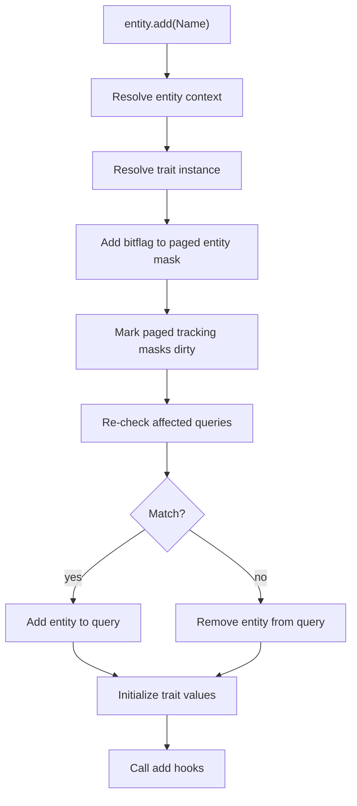

# Structural Changes

Structural changes are updates that change the structure and layout of memory as opposed to mutations which update values in memory.

## Add Trait

Adding a trait is eager.

### Trait arguments

How `entity.add(Name)` propagates through the system when a trait ref is passed directly.

```
entity.add(Name)
```

### Flow



### Steps

**1. Add trait**

```ts
entity.add(Name)
```

The trait ref is passed as an argument. If the entity already has the trait, the operation is a no-op.

**2. Resolve trait instance**

```ts
if (!hasTraitInstance(ctx.traitInstances, trait)) registerTrait(ctx, trait)
const instance = getTraitInstance(ctx.traitInstances, trait)
```

Look up the per-world `TraitInstance` for this trait ref. If this is the first time the world has seen the trait, it is lazily registered allocating storage, assigning a bitflag and generation ID, and integrating with existing queries.

**3. Add bitflag to entity bitmask**

```ts
ensureMaskPage(ctx.entityMasks[generationId], eid >>> 10)[eid & 1023] |= bitflag
```

The trait instance's bitflag is OR'd into the entity's bitmask at the correct generation index. This is the source of truth for "does this entity have this trait".

**4. Mark entity dirty in tracking masks**

```ts
for (const dirtyMask of ctx.dirtyMasks.values()) {
  ensureMaskPage(dirtyMask[generationId], eid >>> 10)[eid & 1023] |= bitflag
}
```

For every registered tracking modifier (`Added`, `Removed`, `Changed`), mark this entity+trait as dirty.

**5. Update queries: check bitmask**

```ts
const match = query.check(ctx, entity)
```

Loop through all queries that reference this trait and compare the entity's updated bitmask against each query's required/forbidden/or masks.

**6. Update queries: add or remove**

```ts
if (match) query.add(entity)
else query.remove(ctx, entity)
```

If the entity's bitmask now satisfies the query, add it to the query's entity set. Otherwise remove it.

**7. Initialize trait values**

```ts
setTrait(ctx, entity, trait, { ...defaults, ...params }, false)
```

After the entity is structurally committed, trait data is initialized from schema defaults merged with any user-provided params. The `triggerChanged` flag is `false` here since this is an add, not a mutation.

**8. Call add hooks**

```ts
for (const sub of data.addSubscriptions) sub(entity)
```

Fire `onAdd` subscriptions for this trait, letting listeners react to the structural change. Hooks run after values are set so listeners can read the initialized data.

## Structural vs mutative changes

`add`, `remove`, `spawn`, relation add/remove, and entity destruction are structural. They change membership, layout, or ownership.

`set` and direct trait value updates are mutative. They usually do not change whether an entity belongs to a query unless a tracking modifier such as `Changed(...)` is involved.

Structural changes update query membership immediately, while ordinary mutations mostly stay within existing storage.
