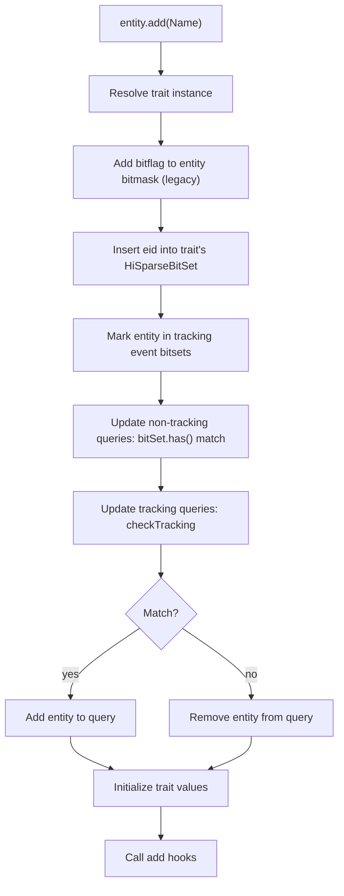
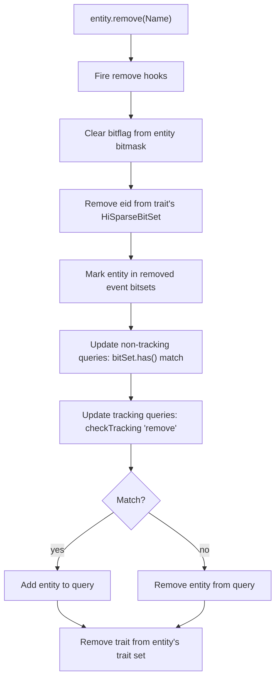
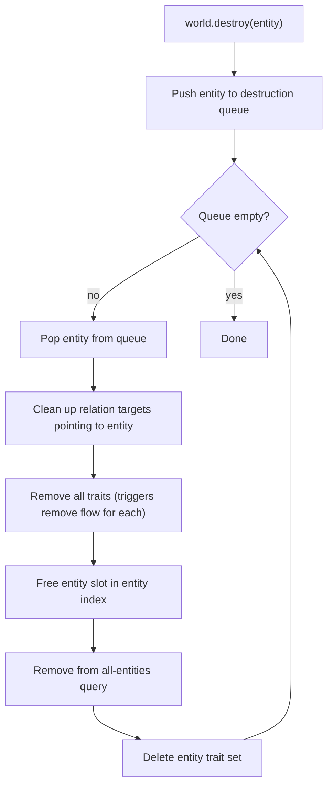
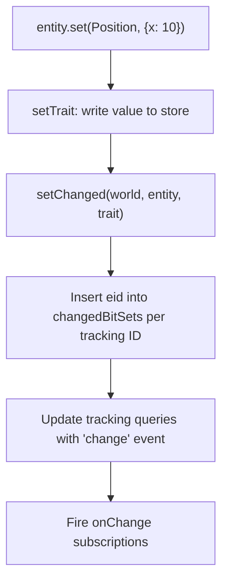

# Structural Changes

Structural changes are updates that change the structure and layout of memory as opposed to mutations which update values in memory.

## Add Trait

Adding a trait is eager.

### Trait arguments

How `entity.add(Name)` propagates through the system when a trait ref is passed directly.

```
entity.add(Name)
```

### Flow



### Steps

**1. Add trait**

```ts
entity.add(Name)
```

The trait ref is passed as an argument. If the entity already has the trait, the operation is a no-op (`hasTrait` checks the legacy bitmask).

**2. Resolve trait instance**

```ts
if (!hasTraitInstance(ctx.traitInstances, trait)) registerTrait(world, trait)
const instance = getTraitInstance(ctx.traitInstances, trait)
```

Look up the per-world `TraitInstance` for this trait ref. If this is the first time the world has seen the trait, it is lazily registered — allocating storage, assigning a bitflag and generation ID, creating a new `HiSparseBitSet`, and integrating with existing queries.

**3. Add bitflag to entity bitmask + insert into bitset**

```ts
ctx.entityMasks[generationId][eid] |= bitflag
instance.bitSet.insert(eid)
```

Two parallel membership records are updated:

| Record                           | Data structure             | Used by                                                  |
| -------------------------------- | -------------------------- | -------------------------------------------------------- |
| `entityMasks[generationId][eid]` | Dense `number[][]` bitmask | `hasTrait()` (legacy path)                               |
| `instance.bitSet`                | `HiSparseBitSet` per trait | `checkQuery()`, `checkQueryTracking()`, query population |

The bitset insert is O(1) — it decomposes the entity ID into L0/L1/L2 indices and sets the corresponding bit, allocating L2 blocks on demand.

**4. Mark entity in tracking event bitsets**

```ts
for (const [, traitMap] of ctx.addedBitSets) {
  let bs = traitMap.get(traitId)
  if (!bs) {
    bs = new HiSparseBitSet()
    traitMap.set(traitId, bs)
  }
  bs.insert(eid)
}
```

For every registered tracking modifier (`Added`, `Removed`, `Changed`), the entity+trait event is recorded in a sparse `HiSparseBitSet` keyed by `(trackingId, traitId)`. Only entities that actually experience events consume memory.

**5. Update non-tracking queries: bitSet.has() match**

```ts
for (const query of instance.queries) {
  query.toRemove.remove(entity)
  const match = query.check(world, entity)
  if (match) query.add(entity)
  else query.remove(world, entity)
}
```

Loop through all non-tracking queries registered on this trait. `query.check()` uses per-trait `bitSet.has(eid)` — an O(1) sparse-array lookup per trait with no generation loop or bitmask aggregation.

**6. Update tracking queries: checkTracking**

```ts
for (const query of instance.trackingQueries) {
  query.toRemove.remove(entity)
  const match = query.checkTracking(world, entity, 'add', trait)
  if (match) query.add(entity)
  else query.remove(world, entity)
}
```

Tracking queries receive the event type (`'add'`) and the specific trait ref. `checkQueryTracking` performs static constraint checks via `bitSet.has()`, updates per-trait tracker bitsets, and verifies tracking group satisfaction.

**7. Initialize trait values**

```ts
const defaults = instance.ctor()
instance.accessors.set(eid, instance.store, { ...defaults, ...params })
```

After the entity is structurally committed, trait data is initialized from schema defaults merged with any user-provided params.

**8. Call add hooks**

```ts
for (const sub of instance.addSubscriptions) sub(entity)
```

Fire `onAdd` subscriptions for this trait, letting listeners react to the structural change. Hooks run after values are set so listeners can read the initialized data.

---

## Remove Trait

Removing a trait mirrors adding, with the membership operations inverted.

### Flow



### Steps

**1. Remove trait**

```ts
entity.remove(Name)
```

If the entity doesn't have the trait, the operation is a no-op.

**2. Fire remove hooks**

```ts
for (const sub of instance.removeSubscriptions) sub(entity)
```

Remove subscriptions fire _before_ the structural change so listeners can still read the trait data.

**3. Clear bitflag + remove from bitset**

```ts
ctx.entityMasks[generationId][eid] &= ~bitflag
instance.bitSet.remove(eid)
```

Both membership records are updated. The bitset remove is O(1) and cascades summary bits upward — if an L2 block becomes empty, its L1 summary bit is cleared; if an L1 group becomes empty, its L0 bit is cleared.

**4. Mark entity in removed event bitsets**

```ts
for (const [, traitMap] of ctx.removedBitSets) {
  let bs = traitMap.get(traitId)
  if (!bs) {
    bs = new HiSparseBitSet()
    traitMap.set(traitId, bs)
  }
  bs.insert(eid)
}
```

Same pattern as add — sparse bitset recording per tracking modifier.

**5–6. Update queries**

Same as add trait — non-tracking queries use `query.check()` with `bitSet.has()`, tracking queries use `query.checkTracking()` with event type `'remove'`.

**7. Remove trait from entity's trait set**

```ts
ctx.entityTraits.get(entity)!.delete(trait)
```

---

## Destroy Entity

Entity destruction removes all traits, then frees the entity slot.

### Flow



### Steps

**1. Queue-based destruction**

Destruction uses a queue to handle cascading relation cleanup. When entity A is destroyed, entities with relations pointing to A have those relations removed, which may trigger further cleanup.

**2. Remove all traits**

```ts
for (const trait of entityTraits) {
  remove(world, currentEntity, trait)
}
```

Each `remove()` call triggers the full remove-trait flow (step 3 above), which clears the bitmask bit, removes from the bitset, marks removed event bitsets, and updates all queries. By the time this loop completes, all bits in `entityMasks` for this entity are already zero — no separate bitmask clearing loop is needed.

**3. Free entity slot**

```ts
releaseEntity(ctx.entityIndex, currentEntity)
```

The entity ID is returned to the free list for reuse.

---

## Change Detection

Mutations (value changes without structural add/remove) are tracked via `setChanged`:

### Flow



### Steps

**1. Write value**

```ts
instance.accessors.set(index, store, value)
```

**2. Mark changed in event bitsets**

```ts
for (const [, traitMap] of ctx.changedBitSets) {
  let bs = traitMap.get(traitId)
  if (!bs) {
    bs = new HiSparseBitSet()
    traitMap.set(traitId, bs)
  }
  bs.insert(eid)
}
```

**3. Update tracking queries**

Only queries with `hasChangedModifiers` and that track this specific trait are checked:

```ts
for (const query of data.trackingQueries) {
  if (!query.hasChangedModifiers) continue
  if (!query.changedTraits.has(trait)) continue
  const match = query.checkTracking(world, entity, 'change', trait)
  if (match) query.add(entity)
  else query.remove(world, entity)
}
```

### Fast path: setChangedFast

Inside `updateEach` loops, `setChangedFast` skips redundant lookups since the caller already has the resolved trait instance:

| Operation                                     | `setChanged` | `setChangedFast`                     |
| --------------------------------------------- | ------------ | ------------------------------------ |
| `hasTrait(world, entity, trait)`              | Yes          | Skipped — entity guaranteed in query |
| `hasTraitInstance` + `registerTrait`          | Yes          | Skipped — trait already registered   |
| `getTraitInstance(ctx.traitInstances, trait)` | Yes          | Skipped — instance passed by caller  |
| BitSet insertions + tracking queries          | Yes          | Yes                                  |
| Change subscriptions                          | Yes          | Yes                                  |

---

## Trait Registration

When a trait is first used on a world, `registerTrait` creates its per-world instance:

```ts
const data: TraitInstance = {
  generationId: ctx.entityMasks.length - 1,
  bitflag: ctx.bitflag,
  bitSet: new HiSparseBitSet(), // ← NEW: per-trait membership bitset
  definition: trait,
  store: createStore(trait.schema),
  // ... queries, subscriptions, etc.
}
```

The `HiSparseBitSet` starts empty (~4 bytes) and grows proportionally to the number of entities that have this trait. A tag trait used by 100 entities out of 100K uses ~400 bytes, not the ~400KB a dense bitmask would require.

After registration, `incrementWorldBitflag` advances the world's bitflag counter. When the 32-bit generation overflows, a new generation is created — but this only affects the legacy `entityMasks` path. The bitset-based query system is generation-agnostic.
